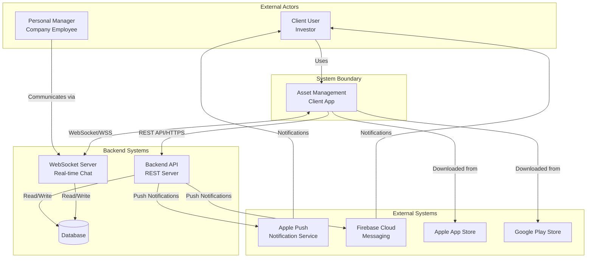
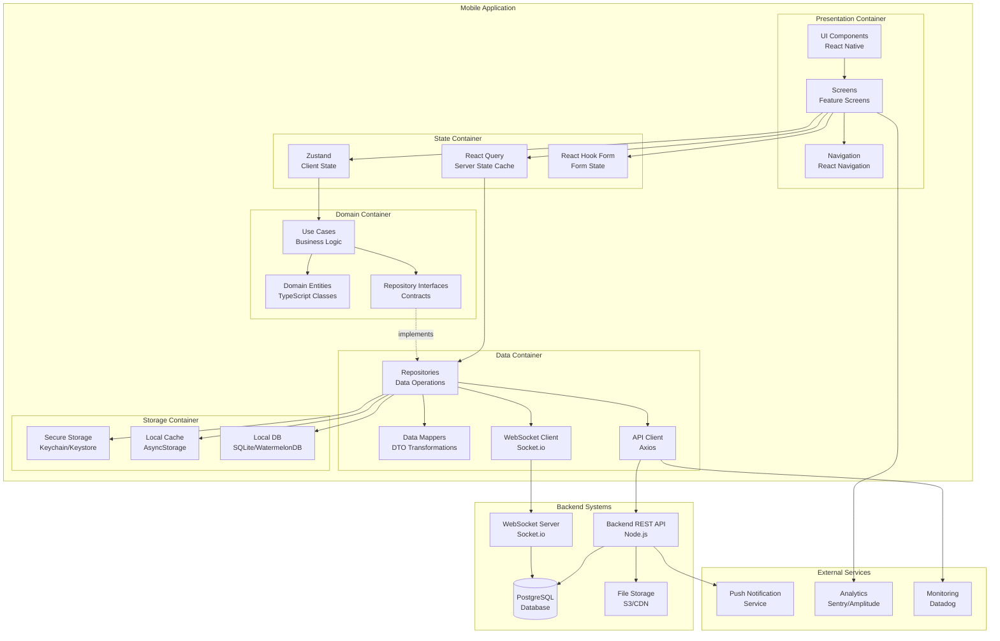
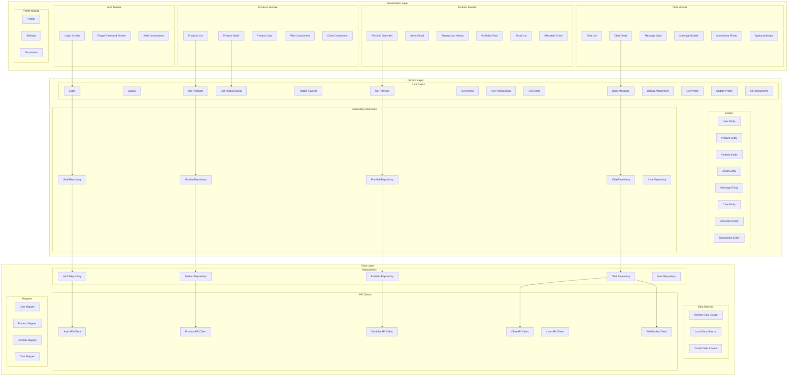
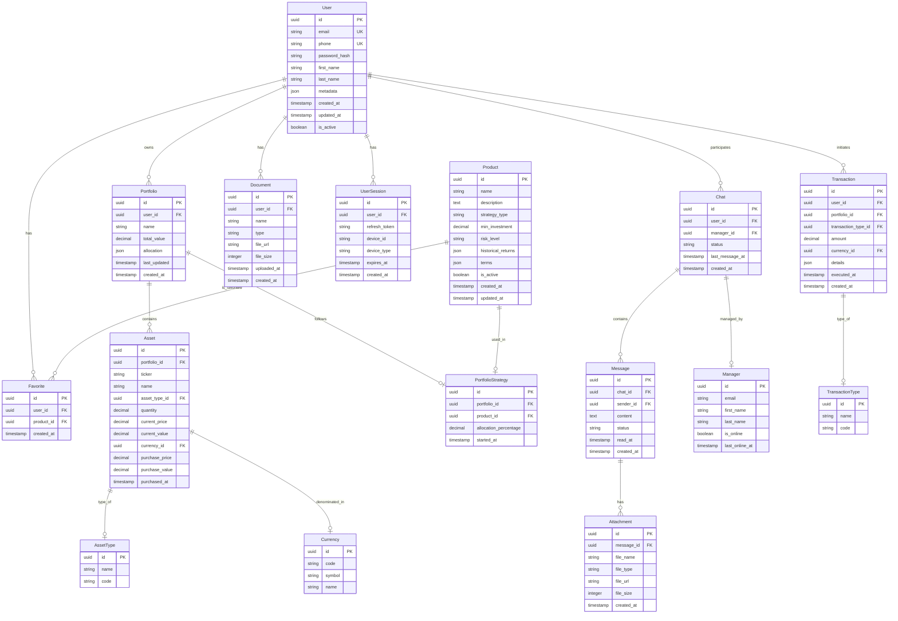
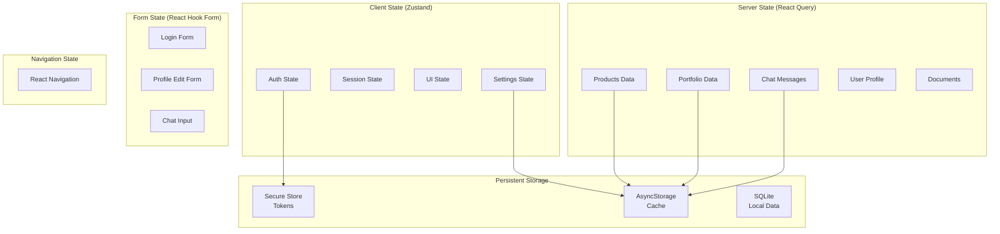
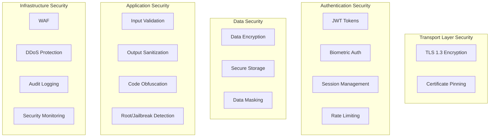
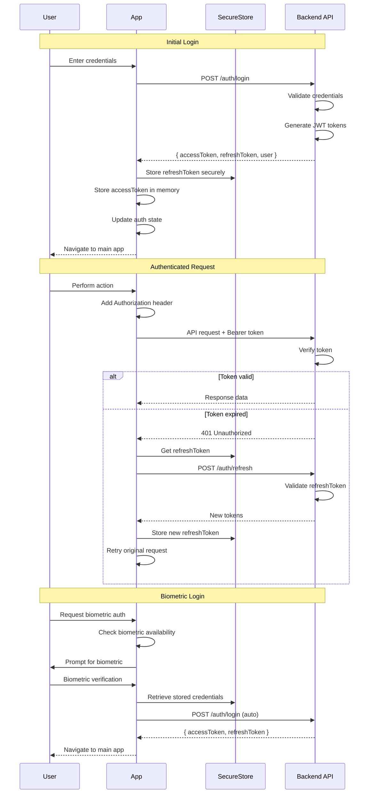
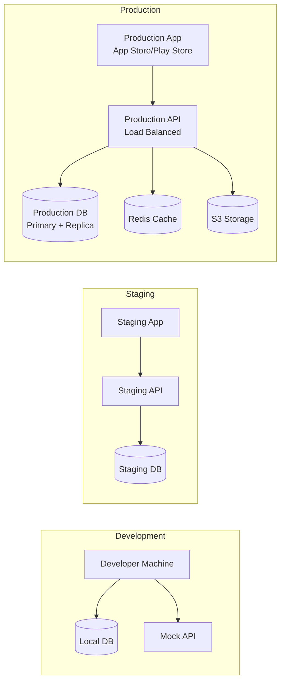

# System Design Document

## Document Information
- **Project:** Asset Management Client App
- **Version:** 1.0
- **Date:** 2026-03-31
- **Author:** Software Architect Agent
- **Status:** Final

---

## Table of Contents
1. [Overview](#1-overview)
2. [Architecture Diagrams (C4 Model)](#2-architecture-diagrams-c4-model)
3. [Components](#3-components)
4. [Data Model](#4-data-model)
5. [API Design](#5-api-design)
6. [State Management](#6-state-management)
7. [Security](#7-security)
8. [Deployment](#8-deployment)

---

## 1. Overview

### 1.1 System Purpose

The Asset Management Client App is a cross-platform mobile application designed for clients of an asset management company. The system enables investors to:

- **View Investment Products:** Browse and analyze available trust management strategies
- **Monitor Portfolio:** Track portfolio performance, asset allocation, and transaction history
- **Communicate with Managers:** Real-time chat with personal managers for investment discussions
- **Access Documents:** View and download reports, statements, and agreements

### 1.2 System Goals

| Goal | Description | Success Metric |
|------|-------------|----------------|
| **Accessibility** | Provide 24/7 mobile access to investment information | DAU > 40% of client base |
| **Transparency** | Clear visualization of portfolio and product data | Session time > 3 minutes |
| **Communication** | Seamless client-manager interaction | 2+ chat interactions/week per user |
| **Security** | Protect sensitive financial data | Zero security breaches |
| **Performance** | Fast, responsive user experience | Load time < 3 seconds |

### 1.3 Key Stakeholders

| Stakeholder | Role | Interest |
|-------------|------|----------|
| **Client Users** | End users | Access portfolio, products, chat with manager |
| **Personal Managers** | Company employees | Communicate with clients, provide support |
| **Asset Management Company** | Business owner | Client satisfaction, reduced support calls |
| **IT Operations** | Technical support | System reliability, monitoring |
| **Compliance Team** | Regulatory oversight | Data protection, audit trails |

### 1.4 System Context

The system operates within the following context:

- **Target Users:** 1,000 - 10,000 initial users (MVP)
- **Platforms:** iOS 13+ and Android 8.0+
- **Data Classification:** Confidential financial data
- **Regulatory Requirements:** GDPR compliance, data protection laws

---

## 2. Architecture Diagrams (C4 Model)

### 2.1 Context Diagram (Level 1)



**Context Description:**

| Element | Type | Description |
|---------|------|-------------|
| Client User | Person | Investor using the mobile app to view portfolio and communicate |
| Personal Manager | Person | Company employee responding to client inquiries |
| Backend API | System | RESTful API providing business data (products, portfolio, user info) |
| WebSocket Server | System | Real-time messaging infrastructure for chat functionality |
| APNs/FCM | System | Push notification delivery services |

### 2.2 Container Diagram (Level 2)



**Container Descriptions:**

| Container | Technology | Purpose |
|-----------|------------|---------|
| **Presentation** | React Native, TypeScript | UI rendering, user interactions |
| **State** | React Query, Zustand | State management and caching |
| **Domain** | TypeScript | Business logic and entities |
| **Data** | Axios, Socket.io | Data operations and API communication |
| **Storage** | Keychain, AsyncStorage, SQLite | Local data persistence |
| **Backend API** | Node.js, Express/Fastify | Business logic, data processing |
| **WebSocket Server** | Socket.io | Real-time bidirectional communication |
| **Database** | PostgreSQL | Persistent data storage |

### 2.3 Component Diagram (Level 3)

#### 2.3.1 Mobile App Components



#### 2.3.2 Backend Components (Reference)

```mermaid
graph TB
    subgraph "API Gateway"
        Gateway[API Gateway<br/>Rate Limiting, Auth]
    end
    
    subgraph "Auth Service"
        AuthController[Auth Controller]
        AuthService[Auth Service]
        TokenManager[JWT Token Manager]
    end
    
    subgraph "Product Service"
        ProductController[Product Controller]
        ProductService[Product Service]
        FavoriteService[Favorite Service]
    end
    
    subgraph "Portfolio Service"
        PortfolioController[Portfolio Controller]
        PortfolioService[Portfolio Service]
        AssetService[Asset Service]
        TransactionService[Transaction Service]
        PortfolioCalculator[Portfolio Calculator]
    end
    
    subgraph "Chat Service"
        ChatController[Chat Controller]
        ChatService[Chat Service]
        MessageService[Message Service]
        AttachmentService[Attachment Service]
    end
    
    subgraph "User Service"
        UserController[User Controller]
        UserService[User Service]
        DocumentService[Document Service]
    end
    
    subgraph "Notification Service"
        NotificationService[Notification Service]
        PushProvider[Push Provider]
    end
    
    subgraph "Data Layer"
        UserRepo[User Repository]
        ProductRepo[Product Repository]
        PortfolioRepo[Portfolio Repository]
        ChatRepo[Chat Repository]
        MessageRepo[Message Repository]
        DocumentRepo[Document Repository]
    end
    
    subgraph "Database"
        PostgreSQL[(PostgreSQL)]
        Redis[(Redis Cache)]
        S3[(S3 File Storage)]
    end
    
    Gateway --> AuthController
    Gateway --> ProductController
    Gateway --> PortfolioController
    Gateway --> ChatController
    Gateway --> UserController
    
    AuthController --> AuthService
    AuthService --> TokenManager
    AuthService --> UserRepo
    
    ProductController --> ProductService
    ProductService --> ProductRepo
    ProductService --> FavoriteService
    
    PortfolioController --> PortfolioService
    PortfolioService --> AssetService
    PortfolioService --> TransactionService
    PortfolioService --> PortfolioCalculator
    PortfolioService --> PortfolioRepo
    
    ChatController --> ChatService
    ChatService --> MessageService
    ChatService --> AttachmentService
    ChatService --> ChatRepo
    ChatService --> MessageRepo
    
    UserController --> UserService
    UserService --> DocumentService
    UserService --> UserRepo
    DocumentService --> DocumentRepo
    
    NotificationService --> PushProvider
    
    UserRepo --> PostgreSQL
    ProductRepo --> PostgreSQL
    PortfolioRepo --> PostgreSQL
    ChatRepo --> PostgreSQL
    MessageRepo --> PostgreSQL
    
    AttachmentService --> S3
    DocumentService --> S3
    
    ProductService --> Redis
    PortfolioService --> Redis
```



---

## 3. Components

### 3.1 Frontend (React Native)

#### 3.1.1 Technology Stack

| Category | Technology | Version | Purpose |
|----------|------------|---------|---------|
| **Framework** | React Native | 0.73+ | Cross-platform mobile development |
| **Language** | TypeScript | 5.0+ | Type-safe development |
| **Navigation** | React Navigation | 6.x | Screen navigation |
| **Server State** | React Query | 5.x | Server state management |
| **Client State** | Zustand | 4.x | Local state management |
| **Styling** | NativeWind | 4.x | Tailwind CSS for React Native |
| **UI Components** | shadcn/ui (adapted) | - | Component library |
| **Forms** | React Hook Form | 7.x | Form handling and validation |
| **HTTP Client** | Axios | 1.x | HTTP requests |
| **WebSocket** | Socket.io Client | 4.x | Real-time communication |
| **Charts** | Victory Native | 40.x | Data visualization |
| **Storage** | AsyncStorage | 1.x | Key-value storage |
| **Secure Storage** | Expo SecureStore / Keychain | 12.x | Encrypted storage |
| **Biometrics** | react-native-biometrics | 3.x | Fingerprint/Face ID |

#### 3.1.2 Component Architecture

```
┌─────────────────────────────────────────────────────────────┐
│                        APP ROOT                              │
│  ┌─────────────────────────────────────────────────────────┐ │
│  │                    Providers                             │ │
│  │  - QueryProvider (React Query)                          │ │
│  │  - AuthProvider (Auth State)                            │ │
│  │  - ThemeProvider (Theme/Style)                          │ │
│  │  - NotificationProvider (Push)                          │ │
│  └─────────────────────────────────────────────────────────┘ │
│                           │                                   │
│  ┌─────────────────────────────────────────────────────────┐ │
│  │                 Navigation Container                     │ │
│  │  ┌─────────────────┐  ┌─────────────────────────────┐  │ │
│  │  │  Auth Stack     │  │     Main Stack              │  │ │
│  │  │  - Login        │  │  ┌───────────────────────┐  │  │ │
│  │  │  - ForgotPwd    │  │  │  Tab Navigator        │  │  │ │
│  │  └─────────────────┘  │  │  - Products Tab       │  │  │ │
│  │                       │  │  - Portfolio Tab      │  │  │ │
│  │                       │  │  - Chat Tab           │  │  │ │
│  │                       │  │  - Profile Tab        │  │  │ │
│  │                       │  └───────────────────────┘  │  │ │
│  │                       │  - Modal Stack              │  │ │
│  │                       └─────────────────────────────┘  │ │
│  └─────────────────────────────────────────────────────────┘ │
└─────────────────────────────────────────────────────────────┘
```

#### 3.1.3 Feature Module Structure

Each feature module follows a consistent structure:

```
feature/
├── screens/           # Screen components
│   └── FeatureScreen.tsx
├── components/        # Feature-specific components
│   ├── FeatureList.tsx
│   └── FeatureItem.tsx
├── hooks/            # Custom hooks
│   ├── useFeature.ts
│   └── useFeatureMutations.ts
├── api/              # API integration
│   ├── featureApi.ts
│   └── featureKeys.ts
├── types/            # TypeScript types
│   └── featureTypes.ts
├── utils/            # Feature utilities
│   └── featureHelpers.ts
└── store/            # Local state (if needed)
    └── featureStore.ts
```

### 3.2 Backend (Node.js)

#### 3.2.1 Architecture Overview

The backend follows a layered architecture:

```
┌─────────────────────────────────────────────────────────────┐
│                      API LAYER                               │
│  Controllers - Request handling, validation, response        │
└─────────────────────────────────────────────────────────────┘
                           │
┌─────────────────────────────────────────────────────────────┐
│                     SERVICE LAYER                            │
│  Business logic, orchestration, transactions                 │
└─────────────────────────────────────────────────────────────┘
                           │
┌─────────────────────────────────────────────────────────────┐
│                   REPOSITORY LAYER                           │
│  Data access, queries, persistence                           │
└─────────────────────────────────────────────────────────────┘
                           │
┌─────────────────────────────────────────────────────────────┐
│                    DATABASE LAYER                            │
│  PostgreSQL, Redis, File Storage                             │
└─────────────────────────────────────────────────────────────┘
```

#### 3.2.2 Technology Stack

| Component | Technology | Purpose |
|-----------|------------|---------|
| **Runtime** | Node.js 20+ | JavaScript runtime |
| **Framework** | Express / Fastify | REST API framework |
| **Database** | PostgreSQL 15+ | Primary data storage |
| **ORM** | Prisma / TypeORM | Database access |
| **Cache** | Redis | Session cache, rate limiting |
| **WebSocket** | Socket.io | Real-time communication |
| **Auth** | JWT | Token-based authentication |
| **Validation** | Zod / Joi | Request validation |
| **File Storage** | AWS S3 / MinIO | Document storage |
| **Queue** | BullMQ | Background jobs |

### 3.3 Database

#### 3.3.1 Primary Database: PostgreSQL

**Rationale:**
- ACID compliance for financial data
- Strong relational integrity
- JSON support for flexible data
- Excellent performance for complex queries
- Mature ecosystem and tooling

**Schema Design Principles:**
- Normalized structure for core entities
- Denormalized views for read-heavy operations
- Soft deletes for audit trail
- Timestamps on all tables
- Encrypted columns for sensitive data

#### 3.3.2 Cache: Redis

**Use Cases:**
- Session storage
- API response caching
- Rate limiting
- Real-time presence indicators
- WebSocket room management

### 3.4 External Services

| Service | Provider | Purpose |
|---------|----------|---------|
| **Push Notifications (iOS)** | Apple Push Notification Service (APNs) | iOS push notifications |
| **Push Notifications (Android)** | Firebase Cloud Messaging (FCM) | Android push notifications |
| **Crash Reporting** | Sentry | Error tracking and reporting |
| **Analytics** | Amplitude / Mixpanel | User behavior analytics |
| **Monitoring** | Datadog / New Relic | Application performance monitoring |
| **File Storage** | AWS S3 / CloudFlare R2 | Document and media storage |
| **CDN** | CloudFlare / AWS CloudFront | Asset delivery |

---

## 4. Data Model

### 4.1 Entity Relationship Diagram (ERD)



### 4.2 Entity Definitions

#### 4.2.1 User Entity

```typescript
interface User {
  id: string;                    // UUID
  email: string;                 // Unique email
  phone?: string;                // Optional phone number
  passwordHash: string;          // Bcrypt hashed password
  firstName: string;
  lastName: string;
  metadata: {
    riskProfile?: 'conservative' | 'moderate' | 'aggressive';
    notificationPreferences: {
      email: boolean;
      push: boolean;
      sms: boolean;
    };
    biometricEnabled: boolean;
  };
  isActive: boolean;
  createdAt: Date;
  updatedAt: Date;
}
```

#### 4.2.2 Product Entity

```typescript
interface Product {
  id: string;                    // UUID
  name: string;
  description: string;
  strategyType: 'growth' | 'income' | 'balanced' | 'custom';
  minInvestment: number;
  riskLevel: 'low' | 'medium' | 'high';
  historicalReturns: {
    year: number;
    return: number;
  }[];
  terms: {
    lockPeriod: number;          // months
    managementFee: number;       // percentage
    performanceFee: number;      // percentage
  };
  isActive: boolean;
  createdAt: Date;
  updatedAt: Date;
}
```

#### 4.2.3 Portfolio Entity

```typescript
interface Portfolio {
  id: string;                    // UUID
  userId: string;                // FK to User
  name: string;
  totalValue: number;
  allocation: {
    byAssetClass: { [assetClass: string]: number };
    byStrategy: { [strategyId: string]: number };
    byCurrency: { [currency: string]: number };
  };
  performance: {
    day: number;
    week: number;
    month: number;
    year: number;
  };
  lastUpdated: Date;
  createdAt: Date;
}
```

#### 4.2.4 Asset Entity

```typescript
interface Asset {
  id: string;                    // UUID
  portfolioId: string;           // FK to Portfolio
  ticker: string;                // e.g., "AAPL", "MSFT"
  name: string;
  assetType: 'stock' | 'bond' | 'fund' | 'etf' | 'cash' | 'other';
  quantity: number;
  currentPrice: number;
  currentValue: number;
  currency: string;              // "USD", "EUR", "RUB"
  purchasePrice: number;
  purchaseValue: number;
  purchasedAt: Date;
  metadata?: {
    isin?: string;
    exchange?: string;
    sector?: string;
  };
}
```

#### 4.2.5 Chat & Message Entities

```typescript
interface Chat {
  id: string;                    // UUID
  userId: string;                // FK to User
  managerId: string;             // FK to Manager
  status: 'active' | 'archived' | 'closed';
  lastMessageAt: Date;
  createdAt: Date;
}

interface Message {
  id: string;                    // UUID
  chatId: string;                // FK to Chat
  senderId: string;              // User or Manager ID
  senderType: 'user' | 'manager';
  content: string;
  status: 'sent' | 'delivered' | 'read';
  readAt?: Date;
  createdAt: Date;
}
```

### 4.3 Data Validation Rules

| Entity | Field | Validation |
|--------|-------|------------|
| User | email | Valid email format, unique |
| User | phone | E.164 format (optional) |
| User | password | Min 8 chars, complexity rules |
| Product | minInvestment | Positive number, min 1000 |
| Portfolio | totalValue | Non-negative number |
| Asset | quantity | Positive number |
| Transaction | amount | Non-zero number |

---

## 5. API Design

### 5.1 API Architecture

**Protocol:** REST over HTTPS  
**Base URL:** `https://api.assetmanagement.com/v1`  
**Authentication:** JWT Bearer Token  
**Content-Type:** `application/json`

### 5.2 Authentication Endpoints

```yaml
POST /auth/login
  Description: Authenticate user and receive tokens
  Request Body:
    {
      "email": "string",
      "password": "string",
      "deviceId": "string"
    }
  Response (200):
    {
      "success": true,
      "data": {
        "user": { User },
        "accessToken": "string",
        "refreshToken": "string",
        "expiresIn": 3600
      }
    }
  Errors: 401 (Invalid credentials), 400 (Validation error)

POST /auth/logout
  Description: Invalidate current session
  Headers: Authorization: Bearer {token}
  Response (200):
    {
      "success": true,
      "message": "Logged out successfully"
    }

POST /auth/refresh
  Description: Refresh access token
  Request Body:
    {
      "refreshToken": "string"
    }
  Response (200):
    {
      "success": true,
      "data": {
        "accessToken": "string",
        "refreshToken": "string",
        "expiresIn": 3600
      }
    }

POST /auth/forgot-password
  Description: Request password reset
  Request Body:
    {
      "email": "string"
    }
  Response (200):
    {
      "success": true,
      "message": "Reset instructions sent"
    }

POST /auth/reset-password
  Description: Reset password with token
  Request Body:
    {
      "token": "string",
      "newPassword": "string"
    }
  Response (200):
    {
      "success": true,
      "message": "Password reset successfully"
    }
```

### 5.3 Products Endpoints

```yaml
GET /products
  Description: List all available products
  Headers: Authorization: Bearer {token}
  Query Parameters:
    - page: number (default: 1)
    - limit: number (default: 20, max: 100)
    - strategyType: string (optional)
    - riskLevel: string (optional)
    - sortBy: string (default: "name")
    - sortOrder: "asc" | "desc"
  Response (200):
    {
      "success": true,
      "data": {
        "products": [Product],
        "pagination": {
          "page": 1,
          "limit": 20,
          "total": 50,
          "totalPages": 3
        }
      }
    }

GET /products/:id
  Description: Get product details
  Headers: Authorization: Bearer {token}
  Path Parameters: id (UUID)
  Response (200):
    {
      "success": true,
      "data": {
        "product": Product,
        "isFavorite": boolean,
        "performanceChart": [{ date, value }]
      }
    }

POST /products/:id/favorite
  Description: Mark product as favorite
  Headers: Authorization: Bearer {token}
  Response (200):
    {
      "success": true,
      "message": "Added to favorites"
    }

DELETE /products/:id/favorite
  Description: Remove from favorites
  Headers: Authorization: Bearer {token}
  Response (200):
    {
      "success": true,
      "message": "Removed from favorites"
    }
```

### 5.4 Portfolio Endpoints

```yaml
GET /portfolio
  Description: Get user's portfolio overview
  Headers: Authorization: Bearer {token}
  Response (200):
    {
      "success": true,
      "data": {
        "portfolio": Portfolio,
        "performance": {
          "day": { value, percentage },
          "week": { value, percentage },
          "month": { value, percentage },
          "year": { value, percentage }
        },
        "allocation": {
          "byAssetClass": [{ name, value, percentage }],
          "byStrategy": [{ name, value, percentage }],
          "byCurrency": [{ name, value, percentage }]
        }
      }
    }

GET /portfolio/assets
  Description: List portfolio assets
  Headers: Authorization: Bearer {token}
  Query Parameters:
    - page: number
    - limit: number
    - assetType: string (optional)
    - sortBy: string
  Response (200):
    {
      "success": true,
      "data": {
        "assets": [Asset],
        "pagination": { ... }
      }
    }

GET /portfolio/assets/:id
  Description: Get asset details
  Headers: Authorization: Bearer {token}
  Response (200):
    {
      "success": true,
      "data": {
        "asset": Asset,
        "history": [{ date, price, value }]
      }
    }

GET /portfolio/transactions
  Description: Get transaction history
  Headers: Authorization: Bearer {token}
  Query Parameters:
    - page: number
    - limit: number
    - type: string (optional)
    - startDate: date (optional)
    - endDate: date (optional)
  Response (200):
    {
      "success": true,
      "data": {
        "transactions": [Transaction],
        "pagination": { ... }
      }
    }

GET /portfolio/history
  Description: Get portfolio value history
  Headers: Authorization: Bearer {token}
  Query Parameters:
    - period: "day" | "week" | "month" | "year"
  Response (200):
    {
      "success": true,
      "data": {
        "history": [{ date, value, change }],
        "summary": { startValue, endValue, totalChange }
      }
    }
```

### 5.5 Chat Endpoints

```yaml
GET /chats
  Description: List user's chats
  Headers: Authorization: Bearer {token}
  Response (200):
    {
      "success": true,
      "data": {
        "chats": [{
          id,
          manager: { id, name, isOnline },
          lastMessage: { content, createdAt },
          unreadCount: number
        }]
      }
    }

GET /chats/:id/messages
  Description: Get chat messages
  Headers: Authorization: Bearer {token}
  Query Parameters:
    - page: number
    - limit: number
    - before: date (optional)
  Response (200):
    {
      "success": true,
      "data": {
        "messages": [Message],
        "pagination": { ... }
      }
    }

POST /chats/:id/messages
  Description: Send a message
  Headers: Authorization: Bearer {token}
  Request Body:
    {
      "content": "string",
      "attachments": [File] (optional)
    }
  Response (201):
    {
      "success": true,
      "data": {
        "message": Message
      }
    }

POST /chats/:id/read
  Description: Mark messages as read
  Headers: Authorization: Bearer {token}
  Request Body:
    {
      "messageIds": ["string"]
    }
  Response (200):
    {
      "success": true
    }

GET /chats/:id/search
  Description: Search messages in chat
  Headers: Authorization: Bearer {token}
  Query Parameters:
    - q: string (search query)
    - page: number
    - limit: number
  Response (200):
    {
      "success": true,
      "data": {
        "messages": [Message],
        "pagination": { ... }
      }
    }
```

### 5.6 User Endpoints

```yaml
GET /user/profile
  Description: Get user profile
  Headers: Authorization: Bearer {token}
  Response (200):
    {
      "success": true,
      "data": {
        "user": User
      }
    }

PUT /user/profile
  Description: Update user profile
  Headers: Authorization: Bearer {token}
  Request Body:
    {
      "firstName": "string",
      "lastName": "string",
      "phone": "string",
      "metadata": { ... }
    }
  Response (200):
    {
      "success": true,
      "data": {
        "user": User
      }
    }

PUT /user/password
  Description: Change password
  Headers: Authorization: Bearer {token}
  Request Body:
    {
      "currentPassword": "string",
      "newPassword": "string"
    }
  Response (200):
    {
      "success": true,
      "message": "Password changed successfully"
    }

GET /user/documents
  Description: List user documents
  Headers: Authorization: Bearer {token}
  Query Parameters:
    - page: number
    - limit: number
    - type: string (optional)
  Response (200):
    {
      "success": true,
      "data": {
        "documents": [Document],
        "pagination": { ... }
      }
    }

GET /user/documents/:id
  Description: Get document download URL
  Headers: Authorization: Bearer {token}
  Response (200):
    {
      "success": true,
      "data": {
        "downloadUrl": "string",
        "expiresAt": "date"
      }
    }
```

### 5.7 WebSocket Events

```yaml
Connection:
  URL: wss://api.assetmanagement.com/ws
  Authentication: Bearer token in handshake

Client → Server Events:
  - chat:join { chatId }
  - chat:leave { chatId }
  - chat:message { chatId, content, attachments }
  - chat:typing { chatId, isTyping }
  - portfolio:subscribe { }
  - portfolio:unsubscribe { }

Server → Client Events:
  - chat:message { chatId, message }
  - chat:message:status { chatId, messageId, status }
  - chat:typing { chatId, userId, isTyping }
  - user:online { userId, isOnline }
  - portfolio:update { portfolio }
  - error { code, message }
```

### 5.8 Error Response Format

```typescript
interface ErrorResponse {
  success: false;
  error: {
    code: string;
    message: string;
    details?: any;
    requestId: string;
  };
}

// HTTP Status Codes
// 400 - Bad Request (validation error)
// 401 - Unauthorized (authentication required)
// 403 - Forbidden (insufficient permissions)
// 404 - Not Found
// 409 - Conflict (duplicate resource)
// 422 - Unprocessable Entity
// 429 - Too Many Requests (rate limit)
// 500 - Internal Server Error
// 503 - Service Unavailable
```

---

## 6. State Management

### 6.1 State Architecture Overview



### 6.2 Server State (React Query)

#### 6.2.1 Query Keys Structure

```typescript
// Query key factory pattern
export const queryKeys = {
  // Products
  products: {
    all: ['products'] as const,
    lists: () => [...queryKeys.products.all, 'list'] as const,
    list: (filters: ProductFilters) => 
      [...queryKeys.products.lists(), filters] as const,
    details: () => [...queryKeys.products.all, 'detail'] as const,
    detail: (id: string) => [...queryKeys.products.details(), id] as const,
  },
  
  // Portfolio
  portfolio: {
    all: ['portfolio'] as const,
    overview: () => [...queryKeys.portfolio.all, 'overview'] as const,
    assets: {
      all: () => [...queryKeys.portfolio.all, 'assets'] as const,
      list: (filters: AssetFilters) => 
        [...queryKeys.portfolio.assets.all(), filters] as const,
      detail: (id: string) => 
        [...queryKeys.portfolio.assets.all(), id] as const,
    },
    transactions: (filters: TransactionFilters) => 
      [...queryKeys.portfolio.all, 'transactions', filters] as const,
    history: (period: string) => 
      [...queryKeys.portfolio.all, 'history', period] as const,
  },
  
  // Chat
  chats: {
    all: ['chats'] as const,
    lists: () => [...queryKeys.chats.all, 'list'] as const,
    detail: (id: string) => [...queryKeys.chats.all, id] as const,
    messages: (chatId: string, filters?: MessageFilters) => 
      [...queryKeys.chats.detail(chatId), 'messages', filters] as const,
  },
  
  // User
  user: {
    all: ['user'] as const,
    profile: () => [...queryKeys.user.all, 'profile'] as const,
    documents: (filters?: DocumentFilters) => 
      [...queryKeys.user.all, 'documents', filters] as const,
  },
};
```

#### 6.2.2 React Query Configuration

```typescript
// Query Client Setup
const queryClient = new QueryClient({
  defaultOptions: {
    queries: {
      // Time until data is considered stale
      staleTime: 5 * 60 * 1000, // 5 minutes
      
      // Time until cache is garbage collected
      gcTime: 10 * 60 * 1000, // 10 minutes
      
      // Retry configuration
      retry: (failureCount, error) => {
        if (error instanceof AuthError) return false;
        return failureCount < 2;
      },
      
      // Retry delay with exponential backoff
      retryDelay: (attemptIndex) => 
        Math.min(1000 * 2 ** attemptIndex, 30000),
      
      // Refetch behavior
      refetchOnWindowFocus: false,
      refetchOnReconnect: true,
      refetchOnMount: true,
      
      // Enable persistance
      notifyOnChangeProps: 'all',
    },
    mutations: {
      retry: 1,
    },
  },
});

// Query Client Provider
function QueryProvider({ children }: { children: React.ReactNode }) {
  return (
    <QueryClientProvider client={queryClient}>
      {children}
      <ReactQueryDevtools initialIsOpen={false} />
    </QueryClientProvider>
  );
}
```

#### 6.2.3 Caching Strategy by Data Type

| Data Type | Stale Time | Cache Time | Refetch Strategy |
|-----------|------------|------------|------------------|
| Products | 5 minutes | 10 minutes | On mount, on reconnect |
| Portfolio | 1 minute | 5 minutes | On mount, WebSocket updates |
| Assets | 2 minutes | 5 minutes | On mount |
| Transactions | 5 minutes | 10 minutes | On mount, manual |
| Chat Messages | 30 seconds | 30 minutes | On mount, WebSocket updates |
| User Profile | 10 minutes | 30 minutes | On mount, on update |
| Documents | 10 minutes | 30 minutes | On mount |

### 6.3 Client State (Zustand)

#### 6.3.1 Auth Store

```typescript
interface AuthState {
  // State
  isAuthenticated: boolean;
  user: User | null;
  accessToken: string | null;
  refreshToken: string | null;
  biometricEnabled: boolean;
  
  // Actions
  login: (user: User, tokens: Tokens) => void;
  logout: () => void;
  updateTokens: (tokens: Tokens) => void;
  updateUser: (user: Partial<User>) => void;
  enableBiometric: () => void;
  disableBiometric: () => void;
}

const useAuthStore = create<AuthState>()(
  persist(
    (set, get) => ({
      // Initial state
      isAuthenticated: false,
      user: null,
      accessToken: null,
      refreshToken: null,
      biometricEnabled: false,
      
      // Actions
      login: (user, tokens) => {
        set({
          isAuthenticated: true,
          user,
          accessToken: tokens.accessToken,
          refreshToken: tokens.refreshToken,
        });
      },
      
      logout: () => {
        set({
          isAuthenticated: false,
          user: null,
          accessToken: null,
          refreshToken: null,
        });
        // Clear secure storage
        SecureStore.deleteItemAsync('accessToken');
        SecureStore.deleteItemAsync('refreshToken');
      },
      
      updateTokens: (tokens) => {
        set({
          accessToken: tokens.accessToken,
          refreshToken: tokens.refreshToken,
        });
        // Update secure storage
        SecureStore.setItemAsync('accessToken', tokens.accessToken);
        SecureStore.setItemAsync('refreshToken', tokens.refreshToken);
      },
      
      updateUser: (userData) => {
        const currentUser = get().user;
        if (currentUser) {
          set({ user: { ...currentUser, ...userData } });
        }
      },
      
      enableBiometric: () => set({ biometricEnabled: true }),
      disableBiometric: () => set({ biometricEnabled: false }),
    }),
    {
      name: 'auth-store',
      storage: createJSONStorage(() => AsyncStorage),
      partialize: (state) => ({
        isAuthenticated: state.isAuthenticated,
        biometricEnabled: state.biometricEnabled,
      }),
    }
  )
);
```

#### 6.3.2 Session Store

```typescript
interface SessionState {
  // State
  lastActivity: Date | null;
  isActive: boolean;
  sessionTimeout: number; // milliseconds
  
  // Actions
  updateActivity: () => void;
  startSession: () => void;
  endSession: () => void;
  setSessionTimeout: (timeout: number) => void;
  
  // Internal
  timeoutId: NodeJS.Timeout | null;
  startTimeoutTimer: () => void;
  clearTimeoutTimer: () => void;
}

const useSessionStore = create<SessionState>((set, get) => ({
  lastActivity: null,
  isActive: false,
  sessionTimeout: 15 * 60 * 1000, // 15 minutes
  timeoutId: null,
  
  updateActivity: () => {
    set({ lastActivity: new Date() });
    get().startTimeoutTimer();
  },
  
  startSession: () => {
    set({ isActive: true, lastActivity: new Date() });
    get().startTimeoutTimer();
  },
  
  endSession: () => {
    const { clearTimeoutTimer } = get();
    clearTimeoutTimer();
    set({ isActive: false, lastActivity: null });
    // Trigger logout
    useAuthStore.getState().logout();
  },
  
  setSessionTimeout: (timeout) => {
    set({ sessionTimeout: timeout });
    get().startTimeoutTimer();
  },
  
  startTimeoutTimer: () => {
    const { sessionTimeout, clearTimeoutTimer, endSession } = get();
    clearTimeoutTimer();
    
    const id = setTimeout(() => {
      endSession();
    }, sessionTimeout);
    
    set({ timeoutId: id });
  },
  
  clearTimeoutTimer: () => {
    const { timeoutId } = get();
    if (timeoutId) {
      clearTimeout(timeoutId);
      set({ timeoutId: null });
    }
  },
}));
```

#### 6.3.3 UI Store

```typescript
interface UIState {
  // Theme
  theme: 'light' | 'dark' | 'system';
  
  // Modals
  activeModal: string | null;
  modalData: any;
  
  // Toasts
  toasts: Toast[];
  
  // Loading states
  globalLoading: boolean;
  
  // Actions
  setTheme: (theme: 'light' | 'dark' | 'system') => void;
  openModal: (modalId: string, data?: any) => void;
  closeModal: () => void;
  showToast: (toast: Omit<Toast, 'id'>) => void;
  hideToast: (id: string) => void;
  setGlobalLoading: (loading: boolean) => void;
}

interface Toast {
  id: string;
  type: 'success' | 'error' | 'warning' | 'info';
  message: string;
  duration?: number;
}

const useUIStore = create<UIState>()(
  persist(
    (set, get) => ({
      theme: 'system',
      activeModal: null,
      modalData: null,
      toasts: [],
      globalLoading: false,
      
      setTheme: (theme) => set({ theme }),
      
      openModal: (modalId, data) => 
        set({ activeModal: modalId, modalData: data }),
      
      closeModal: () => 
        set({ activeModal: null, modalData: null }),
      
      showToast: (toast) => {
        const id = Date.now().toString();
        const newToast = { ...toast, id };
        set((state) => ({ 
          toasts: [...state.toasts, newToast] 
        }));
        
        // Auto-hide after duration
        setTimeout(() => {
          get().hideToast(id);
        }, toast.duration || 3000);
      },
      
      hideToast: (id) => 
        set((state) => ({ 
          toasts: state.toasts.filter((t) => t.id !== id) 
        })),
      
      setGlobalLoading: (loading) => set({ globalLoading: loading }),
    }),
    {
      name: 'ui-store',
      partialize: (state) => ({ theme: state.theme }),
    }
  )
);
```

### 6.4 State Synchronization

#### 6.4.1 WebSocket + React Query Integration

```typescript
// WebSocket message handler that updates React Query cache
function setupWebSocketIntegration(
  socket: Socket,
  queryClient: QueryClient
) {
  // New chat message
  socket.on('chat:message', ({ chatId, message }) => {
    queryClient.setQueryData(
      queryKeys.chats.messages(chatId),
      (old: InfiniteData<Message[]> | undefined) => {
        if (!old) return old;
        return {
          ...old,
          pages: [[message, ...old.pages[0]], ...old.pages.slice(1)],
        };
      }
    );
    
    // Invalidate chat list to update last message
    queryClient.invalidateQueries({ 
      queryKey: queryKeys.chats.lists() 
    });
  });
  
  // Portfolio update
  socket.on('portfolio:update', ({ portfolio }) => {
    queryClient.setQueryData(
      queryKeys.portfolio.overview(),
      portfolio
    );
  });
  
  // Message status update
  socket.on('chat:message:status', ({ chatId, messageId, status }) => {
    queryClient.setQueryData(
      queryKeys.chats.messages(chatId),
      (old: InfiniteData<Message[]> | undefined) => {
        if (!old) return old;
        return {
          ...old,
          pages: old.pages.map((page) =>
            page.map((msg) =>
              msg.id === messageId ? { ...msg, status } : msg
            )
          ),
        };
      }
    );
  });
}
```

---

## 7. Security

### 7.1 Security Architecture



### 7.2 Authentication & Authorization

#### 7.2.1 JWT Token Strategy

```typescript
interface TokenPayload {
  userId: string;
  email: string;
  role: 'user';
  deviceId: string;
  iat: number;
  exp: number;
}

// Token Configuration
const tokenConfig = {
  accessToken: {
    expiresIn: '1h',
    algorithm: 'RS256',
  },
  refreshToken: {
    expiresIn: '7d',
    algorithm: 'RS256',
  },
};

// Token Storage
// - Access Token: Stored in memory + React Query cache
// - Refresh Token: Stored in iOS Keychain / Android Keystore
// - Never store in AsyncStorage or plain text
```

#### 7.2.2 Authentication Flow



#### 7.2.3 Session Management

**Session Timeout:** 15 minutes of inactivity  
**Implementation:**

1. Track user activity (touch events, navigation)
2. Reset timer on each activity
3. Show warning at 12 minutes
4. Auto-logout at 15 minutes
5. Clear all sensitive data on logout

```typescript
// Session timeout implementation
const SESSION_TIMEOUT = 15 * 60 * 1000; // 15 minutes
const WARNING_TIMEOUT = 12 * 60 * 1000; // 12 minutes

function useSessionTimeout() {
  const navigation = useNavigation();
  const logout = useAuthStore((state) => state.logout);
  
  useEffect(() => {
    let timeoutId: NodeJS.Timeout;
    let warningId: NodeJS.Timeout;
    
    const resetTimer = () => {
      clearTimeout(timeoutId);
      clearTimeout(warningId);
      
      // Show warning
      warningId = setTimeout(() => {
        showSessionWarning();
      }, WARNING_TIMEOUT);
      
      // Auto logout
      timeoutId = setTimeout(() => {
        logout();
        navigation.reset({
          index: 0,
          routes: [{ name: 'Login' }],
        });
      }, SESSION_TIMEOUT);
    };
    
    // Listen for user activity
    const subscription = AppState.addEventListener('change', () => {
      resetTimer();
    });
    
    resetTimer();
    
    return () => {
      clearTimeout(timeoutId);
      clearTimeout(warningId);
      subscription.remove();
    };
  }, [logout, navigation]);
}
```

### 7.3 Data Protection

#### 7.3.1 Data Classification

| Data Type | Classification | Storage | Encryption |
|-----------|---------------|---------|------------|
| Password | Critical | Never stored locally | N/A |
| Auth Tokens | Critical | Keychain/Keystore | Hardware-backed |
| Financial Data | Confidential | Encrypted storage | AES-256 |
| Personal Info | Confidential | Encrypted storage | AES-256 |
| Chat Messages | Private | Cache (encrypted) | AES-256 |
| App Settings | Internal | AsyncStorage | Optional |

#### 7.3.2 Encryption Strategy

**In Transit:**
- TLS 1.3 for all communications
- Certificate pinning for production builds
- Encrypted WebSocket (WSS)

**At Rest:**
- iOS: Keychain for tokens, NSFileProtection for files
- Android: Keystore for tokens, EncryptedSharedPreferences for data
- Database: SQLCipher for SQLite (if used)

#### 7.3.3 Certificate Pinning

```typescript
// Certificate pinning configuration
const pinnedCertificates = [
  'sha256/AAAAAAAAAAAAAAAAAAAAAAAAAAAAAAAAAAAAAAAAAAA=',
  // Production certificate hash
];

// Axios instance with SSL pinning
const apiClient = axios.create({
  httpsAgent: new https.Agent({
    rejectUnauthorized: true,
    // Certificate pinning implementation
    // (platform-specific)
  }),
});
```

### 7.4 Security Best Practices

#### 7.4.1 Code Security

| Practice | Implementation |
|----------|---------------|
| **Code Obfuscation** | ProGuard (Android), Hermes (iOS) |
| **Debug Protection** | Disable debug logs in production |
| **Root Detection** | Check for root/jailbreak, warn user |
| **Screen Capture** | Prevent sensitive screens from being captured |
| **Clipboard** | Clear clipboard after timeout |

#### 7.4.2 Input Validation

```typescript
// Zod validation schemas
const loginSchema = z.object({
  email: z.string().email('Invalid email format'),
  password: z.string()
    .min(8, 'Password must be at least 8 characters')
    .regex(/[A-Z]/, 'Must contain uppercase letter')
    .regex(/[a-z]/, 'Must contain lowercase letter')
    .regex(/[0-9]/, 'Must contain number'),
});

const messageSchema = z.object({
  content: z.string()
    .min(1, 'Message cannot be empty')
    .max(5000, 'Message too long')
    .transform(sanitizeHTML),
  attachments: z.array(z.object({
    type: z.enum(['image', 'document']),
    size: z.number().max(10 * 1024 * 1024, 'File too large'),
  })).optional(),
});
```

#### 7.4.3 Security Headers (Backend)

```
Strict-Transport-Security: max-age=31536000; includeSubDomains
X-Content-Type-Options: nosniff
X-Frame-Options: DENY
X-XSS-Protection: 1; mode=block
Content-Security-Policy: default-src 'self'
Referrer-Policy: strict-origin-when-cross-origin
```

---

## 8. Deployment

### 8.1 Environment Overview



### 8.2 Environment Configuration

| Environment | API URL | Features |
|-------------|---------|----------|
| **Development** | `http://localhost:3000` | Mock API, debug tools |
| **Staging** | `https://api-staging.assetmanagement.com` | Test data, beta features |
| **Production** | `https://api.assetmanagement.com` | Production data, strict security |

### 8.3 Build & Release Process

#### 8.3.1 CI/CD Pipeline

```yaml
# .github/workflows/mobile-app.yml
name: Mobile App CI/CD

on:
  push:
    branches: [main, develop]
  pull_request:
    branches: [main]

jobs:
  test:
    runs-on: ubuntu-latest
    steps:
      - uses: actions/checkout@v3
      - uses: actions/setup-node@v3
        with:
          node-version: '20'
      - run: npm ci
      - run: npm run lint
      - run: npm run type-check
      - run: npm run test:coverage
      - name: Upload coverage
        uses: codecov/codecov-action@v3

  build-ios:
    needs: test
    runs-on: macos-latest
    steps:
      - uses: actions/checkout@v3
      - uses: actions/setup-node@v3
      - run: npm ci
      - run: npm run ios:build
      - name: Upload to TestFlight
        if: github.ref == 'refs/heads/main'
        run: npm run ios:upload

  build-android:
    needs: test
    runs-on: ubuntu-latest
    steps:
      - uses: actions/checkout@v3
      - uses: actions/setup-node@v3
      - uses: actions/setup-java@v3
        with:
          java-version: '17'
      - run: npm ci
      - run: npm run android:build
      - name: Upload to Play Store
        if: github.ref == 'refs/heads/main'
        run: npm run android:upload
```

#### 8.3.2 Build Variants

| Variant | Platform | Purpose | Distribution |
|---------|----------|---------|--------------|
| **Debug** | iOS/Android | Development, testing | Local |
| **Release (Internal)** | iOS/Android | Internal testing | TestFlight/Internal |
| **Release (Beta)** | iOS/Android | Beta testing | TestFlight/Play Console |
| **Release (Production)** | iOS/Android | Production | App Store/Play Store |

### 8.4 App Store Deployment

#### 8.4.1 iOS (App Store)

**Prerequisites:**
- Apple Developer Account
- App ID configured
- Push notification certificates
- App Store Connect app record

**Process:**
1. Build archive in Xcode
2. Upload to App Store Connect via Transporter
3. Configure TestFlight for beta testing
4. Submit for App Store review
5. Release after approval

**Configuration:**
```
Bundle ID: com.assetmanagement.client
Version: 1.0.0
Build: 1
Minimum iOS: 13.0
Capabilities: Push Notifications, Face ID, Keychain Sharing
```

#### 8.4.2 Android (Google Play)

**Prerequisites:**
- Google Play Developer Account
- Signing key (keystore)
- Google Services JSON

**Process:**
1. Generate signed APK/AAB
2. Upload to Google Play Console
3. Configure internal/beta testing tracks
4. Submit for review
5. Release after approval

**Configuration:**
```
Application ID: com.assetmanagement.client
Version Code: 1
Version Name: 1.0.0
Minimum SDK: 26 (Android 8.0)
Target SDK: 34 (Android 14)
Permissions: Internet, Camera, Biometric, Push Notifications
```

### 8.5 Monitoring & Observability

#### 8.5.1 Monitoring Stack

| Component | Tool | Purpose |
|-----------|------|---------|
| **Crash Reporting** | Sentry | Error tracking and reporting |
| **Analytics** | Amplitude | User behavior analytics |
| **Performance** | Datadog | Application performance monitoring |
| **Uptime** | Pingdom | Service availability monitoring |
| **Logging** | LogRocket | Session replay and logs |

#### 8.5.2 Key Metrics

**Application Metrics:**
- Crash-free rate > 99%
- App launch time < 3 seconds
- Screen load time < 1 second
- Memory usage < 200MB

**Business Metrics:**
- Daily Active Users (DAU)
- Session duration
- Feature usage rates
- User retention (D1, D7, D30)

**Technical Metrics:**
- API response time (p50, p95, p99)
- Error rates by type
- WebSocket connection stability
- Push notification delivery rate

### 8.6 Rollback Strategy

**Mobile App Rollback:**
1. Store previous version binaries
2. App Store/Play Store can promote previous version
3. Feature flags to disable problematic features
4. Force update mechanism for critical fixes

**Backend Rollback:**
1. Blue-green deployment
2. Database migrations backward compatible
3. API versioning (v1, v2)
4. Feature flags for gradual rollout

---

## 9. Appendices

### 9.1 Technology Stack Summary

| Category | Technology | Version | Purpose |
|----------|------------|---------|---------|
| **Mobile Framework** | React Native | 0.73+ | Cross-platform mobile |
| **Language** | TypeScript | 5.0+ | Type-safe development |
| **Navigation** | React Navigation | 6.x | Screen navigation |
| **State Management** | React Query + Zustand | 5.x, 4.x | Server and client state |
| **Styling** | NativeWind | 4.x | Tailwind for React Native |
| **HTTP Client** | Axios | 1.x | API communication |
| **WebSocket** | Socket.io Client | 4.x | Real-time communication |
| **Charts** | Victory Native | 40.x | Data visualization |
| **Forms** | React Hook Form | 7.x | Form handling |
| **Storage** | AsyncStorage, SecureStore | - | Data persistence |
| **Backend** | Node.js, Express | 20+, 4.x | API server |
| **Database** | PostgreSQL | 15+ | Primary data store |
| **Cache** | Redis | 7.x | Caching, sessions |
| **Testing** | Jest, Detox | 29+, - | Unit and E2E tests |
| **CI/CD** | GitHub Actions | - | Build and deployment |
| **Monitoring** | Sentry, Datadog | - | Error tracking, APM |

### 9.2 Glossary

| Term | Definition |
|------|------------|
| **Asset Management** | Professional management of investment portfolios |
| **Trust Management** | Service where assets are managed by professionals on behalf of clients |
| **Portfolio** | Collection of financial investments owned by a client |
| **Asset** | Individual investment holding (stock, bond, fund) |
| **Strategy** | Investment approach with defined risk and return parameters |
| **Personal Manager** | Dedicated employee assigned to manage client relationship |
| **JWT** | JSON Web Token - secure token format for authentication |
| **WebSocket** | Protocol for real-time bidirectional communication |
| **React Query** | Library for managing server state in React applications |
| **Zustand** | Lightweight state management library for React |

### 9.3 References

- [React Native Documentation](https://reactnative.dev/)
- [React Navigation](https://reactnavigation.org/)
- [React Query](https://tanstack.com/query/latest)
- [Zustand](https://github.com/pmndrs/zustand)
- [NativeWind](https://www.nativewind.dev/)
- [Victory Native](https://commerce.nearform.com/open-source/victory-native/)
- [Socket.io](https://socket.io/)
- [PostgreSQL](https://www.postgresql.org/)
- [Sentry](https://sentry.io/)

---

**Document Status:** Final  
**Last Updated:** 2026-03-31  
**Next Review:** 2026-04-30
