# System Design - Asset Management Client Portal

## Document Information
**Project:** Asset Management Client Portal  
**Version:** 1.0  
**Date:** 2026-03-31  
**Author:** Software Architect  

---

## 1. Executive Summary

This document presents the comprehensive system architecture for the Asset Management Client Portal, a React Native mobile application for iOS and Android platforms. The architecture follows Clean Architecture principles with three distinct layers, ensuring scalability, maintainability, and testability.

---

## 2. Architecture Pattern Selection

### 2.1 Chosen Pattern: Clean Architecture (Three-Layer)

**Decision Rationale:**

| Criteria | Clean Architecture | MVC | MVVM | Redux Architecture |
|----------|-------------------|-----|------|-------------------|
| Testability | ✅ Excellent | ⚠️ Good | ✅ Excellent | ✅ Excellent |
| Scalability | ✅ Excellent | ⚠️ Moderate | ✅ Good | ✅ Good |
| Maintainability | ✅ Excellent | ⚠️ Moderate | ✅ Good | ⚠️ Moderate |
| Business Logic Separation | ✅ Excellent | ❌ Poor | ✅ Good | ⚠️ Moderate |
| Dependency Management | ✅ Excellent | ❌ Poor | ⚠️ Moderate | ⚠️ Moderate |
| Learning Curve | ⚠️ Moderate | ✅ Easy | ✅ Easy | ⚠️ Moderate |
| React Native Fit | ✅ Excellent | ⚠️ Moderate | ✅ Good | ✅ Excellent |

**Selected Pattern:** Clean Architecture with three layers (View, Domain, Adapters)

**Benefits for this project:**
- Clear separation of concerns
- Domain layer independent of frameworks
- Easy to test business logic
- Flexible API integration
- Maintainable as features grow
- Supports real-time features (WebSocket)

---

## 3. C4 Model - System Architecture

### 3.1 Level 1: System Context Diagram

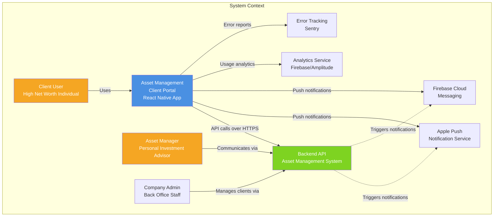

**Context Description:**

The Asset Management Client Portal is a mobile application that enables clients to:
- View their investment portfolio
- Browse available investment products
- Communicate with their personal asset manager
- Receive notifications about portfolio changes

External systems:
- **Backend API:** Core business logic and data storage
- **APNs/FCM:** Push notification delivery
- **Analytics:** User behavior tracking
- **Monitoring:** Error tracking and performance monitoring

---

### 3.2 Level 2: Container Diagram

```mermaid
graph TB
    subgraph "Mobile Application"
        subgraph "View Layer"
            Screens[Screens<br/>React Native Components]
            Components[UI Components<br/>shadcn/ui + Tailwind]
            Navigation[Navigation<br/>React Navigation v6]
        end
        
        subgraph "Domain Layer"
            UseCases[Use Cases<br/>Business Logic]
            Entities[Entities<br/>Business Models]
            Repositories[Repository Interfaces<br/>Data Contracts]
        end
        
        subgraph "Adapters Layer"
            APIClient[API Client<br/>Axios + React Query]
            WebSocket[WebSocket Manager<br/>Socket.io Client]
            Storage[Storage Adapter<br/>AsyncStorage + Keychain]
            Biometric[Biometric Adapter<br/>Face ID/Touch ID]
            PushAdapter[Push Notification Adapter<br/>Firebase Messaging]
        end
        
        State[State Management<br/>Zustand]
        I18n[Localization<br/>react-i18next]
    end
    
    subgraph "External Systems"
        Backend[Backend API<br/>REST + WebSocket]
        SecureStorage[Secure Storage<br/>Keychain/Keystore]
        DeviceBiometric[Device Biometric<br/>Face ID/Touch ID]
        PushService[Push Services<br/>APNs/FCM]
    end
    
    Screens --> Components
    Screens --> Navigation
    Screens --> UseCases
    Screens --> State
    Screens --> I18n
    
    UseCases --> Entities
    UseCases --> Repositories
    
    APIClient --> Repositories
    WebSocket --> Repositories
    Storage --> Repositories
    Biometric --> Repositories
    PushAdapter --> Repositories
    
    APIClient --> Backend
    WebSocket --> Backend
    Storage --> SecureStorage
    Biometric --> DeviceBiometric
    PushAdapter --> PushService
    
    style State fill:#E6F3FF,stroke:#4A90E2
    style UseCases fill:#E6F3FF,stroke:#4A90E2
    style APIClient fill:#E6F3FF,stroke:#4A90E2
```

**Container Description:**

| Container | Technology | Responsibility |
|-----------|------------|----------------|
| **View Layer** | React Native + TypeScript | UI presentation, user interaction, navigation |
| **Domain Layer** | TypeScript (framework-agnostic) | Business logic, entities, use cases |
| **Adapters Layer** | TypeScript + Libraries | External integrations, data persistence, platform APIs |
| **State Management** | Zustand | Global application state |
| **Localization** | react-i18next | Internationalization (Russian for MVP) |

---

### 3.3 Level 3: Component Diagram

```mermaid
graph TB
    subgraph "View Layer Components"
        subgraph "Authentication"
            LoginScreen[Login Screen]
            ForgotPasswordScreen[Forgot Password Screen]
            BiometricPrompt[Biometric Prompt]
        end
        
        subgraph "Products"
            ProductListScreen[Product List Screen]
            ProductDetailsScreen[Product Details Screen]
            InterestModal[Interest Expression Modal]
        end
        
        subgraph "Portfolio"
            PortfolioScreen[Portfolio Overview Screen]
            PositionList[Position List Component]
            TransactionHistory[Transaction History Screen]
            PerformanceChart[Performance Chart]
            AllocationChart[Allocation Chart]
        end
        
        subgraph "Chat"
            ChatScreen[Chat Screen]
            MessageList[Message List]
            MessageInput[Message Input]
            ManagerStatus[Manager Status]
        end
        
        subgraph "Common"
            ProfileScreen[Profile Screen]
            SettingsScreen[Settings Screen]
            ErrorBoundary[Error Boundary]
            LoadingStates[Loading States]
        end
    end
    
    subgraph "Domain Layer Components"
        subgraph "Authentication Domain"
            AuthUseCases[Auth Use Cases<br/>Login, Logout, Refresh]
            SessionManager[Session Manager<br/>Token Lifecycle]
            AuthEntities[Auth Entities<br/>User, Session, Credentials]
        end
        
        subgraph "Product Domain"
            ProductUseCases[Product Use Cases<br/>GetProducts, GetDetails, ExpressInterest]
            ProductEntities[Product Entities<br/>Product, ProductCategory]
        end
        
        subgraph "Portfolio Domain"
            PortfolioUseCases[Portfolio Use Cases<br/>GetPortfolio, GetPositions, GetTransactions]
            PortfolioEntities[Portfolio Entities<br/>Portfolio, Position, Transaction]
        end
        
        subgraph "Chat Domain"
            ChatUseCases[Chat Use Cases<br/>SendMessage, GetHistory, Subscribe]
            ChatEntities[Chat Entities<br/>Message, Conversation, Manager]
        end
    end
    
    subgraph "Adapters Layer Components"
        subgraph "API Clients"
            AuthAPI[Auth API Client]
            ProductAPI[Product API Client]
            PortfolioAPI[Portfolio API Client]
            ChatAPI[Chat API Client]
        end
        
        subgraph "Infrastructure"
            HTTPClient[HTTP Client<br/>Axios + Interceptors]
            WSService[WebSocket Service<br/>Socket.io]
            CacheService[Cache Service<br/>AsyncStorage]
            SecureStore[Secure Storage<br/>Keychain/Keystore]
            PushService[Push Notification Service]
            BiometricService[Biometric Service]
        end
        
        subgraph "Repositories"
            AuthRepo[Auth Repository]
            ProductRepo[Product Repository]
            PortfolioRepo[Portfolio Repository]
            ChatRepo[Chat Repository]
        end
    end
    
    LoginScreen --> AuthUseCases
    ProductListScreen --> ProductUseCases
    PortfolioScreen --> PortfolioUseCases
    ChatScreen --> ChatUseCases
    
    AuthUseCases --> AuthRepo
    ProductUseCases --> ProductRepo
    PortfolioUseCases --> PortfolioRepo
    ChatUseCases --> ChatRepo
    
    AuthRepo --> AuthAPI
    AuthRepo --> SecureStore
    AuthRepo --> BiometricService
    
    ProductRepo --> ProductAPI
    ProductRepo --> CacheService
    
    PortfolioRepo --> PortfolioAPI
    PortfolioRepo --> CacheService
    
    ChatRepo --> ChatAPI
    ChatRepo --> WSService
    
    AuthAPI --> HTTPClient
    ProductAPI --> HTTPClient
    PortfolioAPI --> HTTPClient
    ChatAPI --> HTTPClient
```

---

## 4. System Layers

### 4.1 View Layer (Presentation)

**Purpose:** Handle UI rendering, user interactions, and navigation.

**Components:**

| Category | Components | Responsibilities |
|----------|------------|------------------|
| **Screens** | LoginScreen, ProductListScreen, PortfolioScreen, ChatScreen | Container components, orchestrate UI |
| **UI Components** | Button, Input, Card, Modal, Chart | Reusable presentational components |
| **Navigation** | TabNavigator, StackNavigator, DeepLinkHandler | Navigation and routing |
| **Hooks** | useAuth, useProducts, usePortfolio, useChat | View-model logic, state access |
| **HOCs** | withAuth, withErrorBoundary, withLoading | Cross-cutting concerns |

**Technologies:**
- React Native (UI framework)
- React Navigation v6 (navigation)
- Tailwind CSS / twrnc (styling)
- shadcn/ui (component library)

**Design Principles:**
- Components are stateless (mostly)
- State managed by hooks and Zustand
- No business logic in components
- Optimistic UI updates for chat

### 4.2 Domain Layer (Business Logic)

**Purpose:** Contain business logic, rules, and entities.

**Components:**

| Category | Components | Responsibilities |
|----------|------------|------------------|
| **Entities** | User, Session, Product, Portfolio, Position, Message | Business models with behavior |
| **Use Cases** | LoginUseCase, GetProductsUseCase, SendMessageUseCase | Application-specific business rules |
| **Repository Interfaces** | IAuthRepository, IProductRepository, IPortfolioRepository | Data access contracts |
| **Value Objects** | Credentials, Money, Percentage | Immutable value objects |
| **Services** | ValidationService, CalculationService | Domain services |

**Technologies:**
- Pure TypeScript (no framework dependencies)
- Dependency injection pattern

**Design Principles:**
- No external dependencies
- Framework-agnostic
- Pure business logic
- Unit testable
- Single responsibility

**Entity Examples:**

```typescript
// Domain Entity Example
export class Portfolio {
  constructor(
    public readonly id: string,
    public readonly totalValue: Money,
    public readonly positions: Position[],
    public readonly performance: Performance,
    public readonly lastUpdated: Date
  ) {}
  
  get totalPerformancePercentage(): Percentage {
    return this.performance.percentage;
  }
  
  getPositionByAsset(assetId: string): Position | undefined {
    return this.positions.find(p => p.asset.id === assetId);
  }
  
  calculateAllocation(): AssetAllocation[] {
    // Business logic for allocation calculation
  }
  
  isStale(maxAgeMinutes: number): boolean {
    const now = new Date();
    const ageMs = now.getTime() - this.lastUpdated.getTime();
    return ageMs > maxAgeMinutes * 60 * 1000;
  }
}
```

**Use Case Example:**

```typescript
// Domain Use Case Example
export class GetPortfolioUseCase {
  constructor(
    private readonly portfolioRepository: IPortfolioRepository,
    private readonly cacheService: ICacheService
  ) {}
  
  async execute(params: GetPortfolioParams): Promise<Result<Portfolio, PortfolioError>> {
    // Check cache first
    const cached = await this.cacheService.get<Portfolio>('portfolio');
    if (cached && !cached.isStale(5)) {
      return Result.ok(cached);
    }
    
    // Fetch from repository
    const result = await this.portfolioRepository.getPortfolio(params.userId);
    
    if (result.isSuccess()) {
      // Update cache
      await this.cacheService.set('portfolio', result.value, 300); // 5 minutes
    }
    
    return result;
  }
}
```

### 4.3 Adapters Layer (Infrastructure)

**Purpose:** Implement interfaces, integrate with external systems.

**Components:**

| Category | Components | Responsibilities |
|----------|------------|------------------|
| **API Clients** | AuthAPIClient, ProductAPIClient, PortfolioAPIClient, ChatAPIClient | HTTP API communication |
| **Repositories** | AuthRepository, ProductRepository, PortfolioRepository, ChatRepository | Implement domain interfaces |
| **Storage** | AsyncStorageAdapter, SecureStorageAdapter, CacheAdapter | Local data persistence |
| **Platform** | BiometricAdapter, PushNotificationAdapter, FileSystemAdapter | Platform-specific APIs |
| **WebSocket** | WebSocketManager, MessageQueue, ConnectionMonitor | Real-time communication |

**Technologies:**
- Axios (HTTP client)
- Socket.io Client (WebSocket)
- React Native Keychain (secure storage)
- AsyncStorage (local storage)
- Firebase Messaging (push notifications)

**Design Principles:**
- Implement domain interfaces
- Handle external system errors
- Map external data to domain entities
- Retry and recovery logic

---

## 5. Data Flow Architecture

### 5.1 Request Flow (Read Operations)

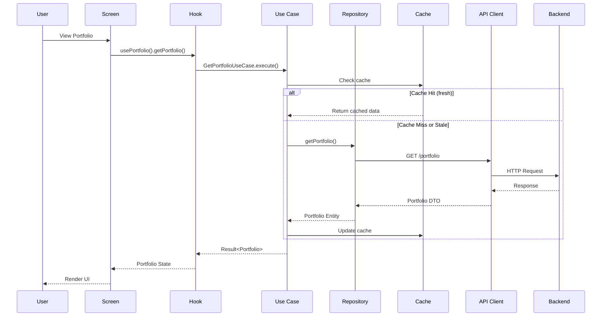

### 5.2 Command Flow (Write Operations)

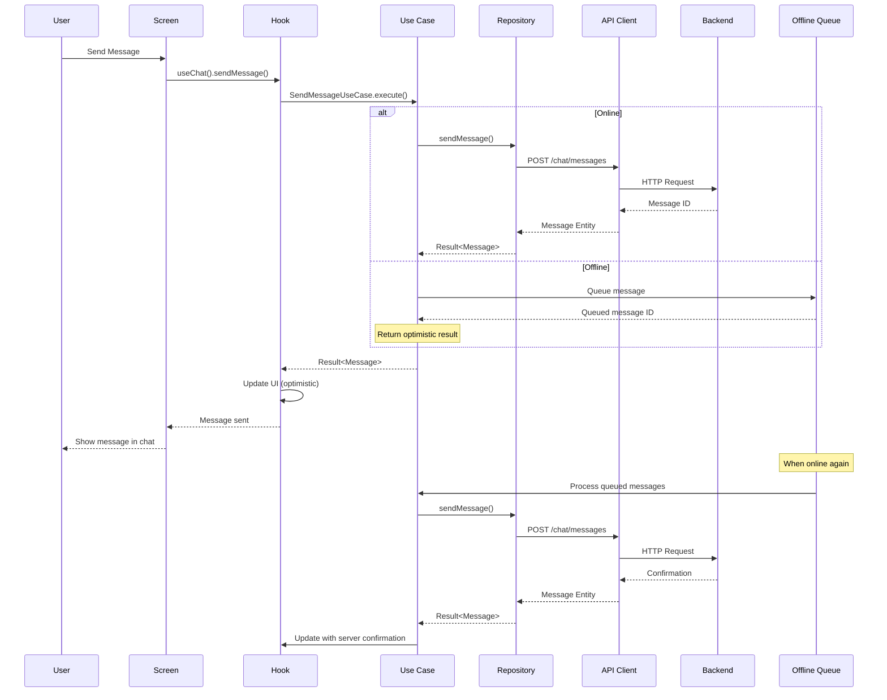

### 5.3 Real-Time Flow (WebSocket)

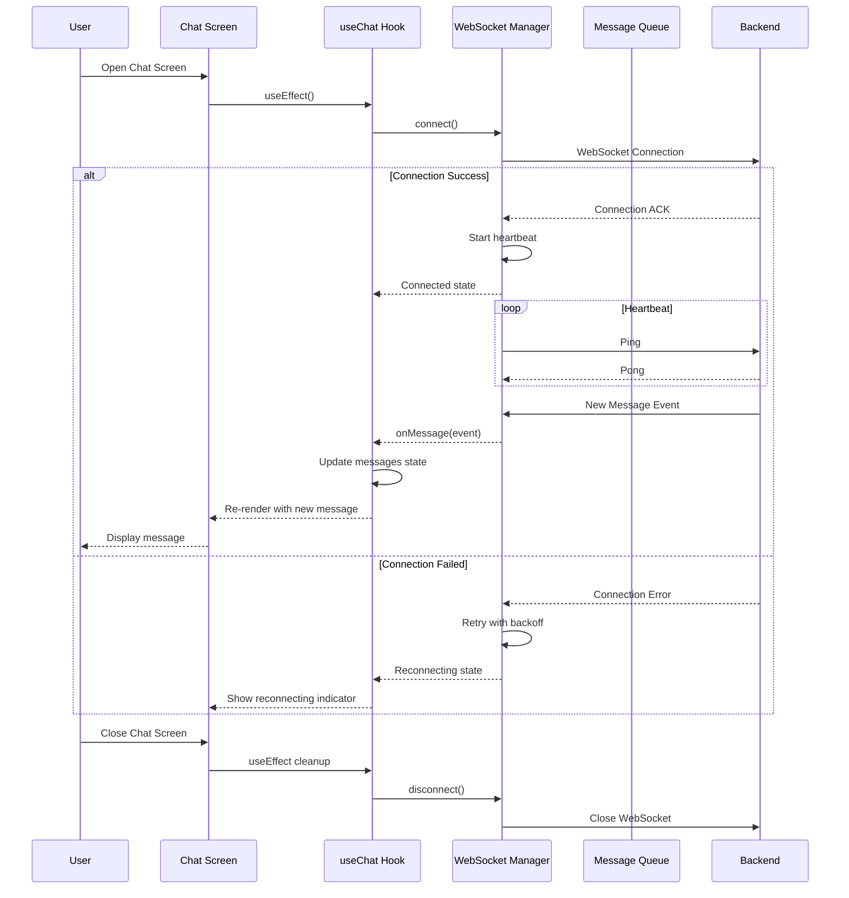

### 5.4 Authentication Flow

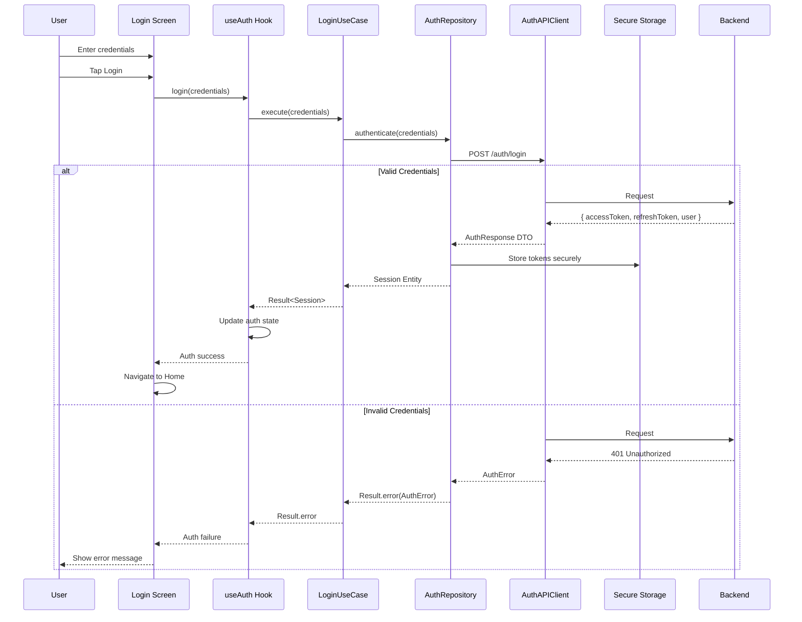

---

## 6. State Management Architecture

### 6.1 State Management Strategy

**Chosen Approach:** Zustand + React Query

**Rationale:**

| Criteria | Zustand | Redux Toolkit | Context API |
|----------|---------|---------------|-------------|
| Bundle Size | ✅ Tiny (1KB) | ⚠️ Moderate (11KB) | ✅ Built-in |
| Learning Curve | ✅ Easy | ⚠️ Moderate | ✅ Easy |
| TypeScript Support | ✅ Excellent | ✅ Excellent | ✅ Good |
| DevTools | ✅ Good | ✅ Excellent | ❌ None |
| Performance | ✅ Excellent | ✅ Good | ⚠️ Re-render issues |
| Boilerplate | ✅ Minimal | ⚠️ Moderate | ✅ Minimal |
| React Native Fit | ✅ Excellent | ✅ Excellent | ✅ Excellent |

**State Categories:**

| State Type | Scope | Management | Examples |
|------------|-------|------------|----------|
| **Server State** | Cached API data | React Query | Products, Portfolio, Messages |
| **Client State** | Global UI state | Zustand | Auth session, Navigation state |
| **Form State** | Local to screen | React Hook Form | Login form, Interest form |
| **UI State** | Local to component | useState | Modal visibility, Loading states |

### 6.2 Zustand Store Structure

```typescript
// Auth Store
interface AuthState {
  user: User | null;
  session: Session | null;
  isAuthenticated: boolean;
  isLoading: boolean;
  
  // Actions
  login: (credentials: Credentials) => Promise<void>;
  logout: () => Promise<void>;
  refreshSession: () => Promise<void>;
  setUser: (user: User) => void;
}

// Navigation Store
interface NavigationState {
  currentTab: TabType;
  previousScreen: string | null;
  
  // Actions
  setCurrentTab: (tab: TabType) => void;
}

// UI Store
interface UIState {
  isOnline: boolean;
  theme: 'light' | 'dark';
  language: 'ru' | 'en';
  
  // Actions
  setOnlineStatus: (isOnline: boolean) => void;
}
```

### 6.3 React Query Configuration

```typescript
// React Query Setup
const queryClient = new QueryClient({
  defaultOptions: {
    queries: {
      staleTime: 5 * 60 * 1000, // 5 minutes
      cacheTime: 10 * 60 * 1000, // 10 minutes
      retry: 3,
      retryDelay: (attemptIndex) => Math.min(1000 * 2 ** attemptIndex, 30000),
      refetchOnWindowFocus: false,
      refetchOnReconnect: true,
    },
    mutations: {
      retry: 1,
    },
  },
});

// Query Keys Structure
const queryKeys = {
  auth: {
    user: ['auth', 'user'] as const,
    session: ['auth', 'session'] as const,
  },
  products: {
    all: ['products'] as const,
    list: (filters: ProductFilters) => ['products', 'list', filters] as const,
    detail: (id: string) => ['products', 'detail', id] as const,
  },
  portfolio: {
    overview: ['portfolio', 'overview'] as const,
    positions: ['portfolio', 'positions'] as const,
    transactions: (filters: TransactionFilters) => ['portfolio', 'transactions', filters] as const,
  },
  chat: {
    history: ['chat', 'history'] as const,
    manager: ['chat', 'manager'] as const,
  },
};
```

### 6.4 Data Flow with State Management

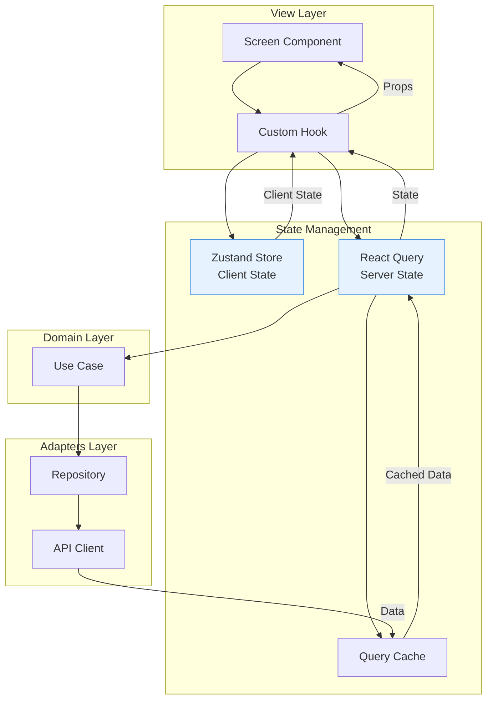

---

## 7. Component Boundaries & Interfaces

### 7.1 Repository Interfaces (Domain Layer)

```typescript
// Authentication Repository Interface
export interface IAuthRepository {
  login(credentials: Credentials): Promise<Result<Session, AuthError>>;
  logout(): Promise<Result<void, AuthError>>;
  refreshToken(refreshToken: string): Promise<Result<Session, AuthError>>;
  forgotPassword(email: string): Promise<Result<void, AuthError>>;
  getSession(): Promise<Session | null>;
  getSessionStatus(): Promise<SessionStatus>;
}

// Product Repository Interface
export interface IProductRepository {
  getProducts(params: GetProductsParams): Promise<Result<Product[], ProductError>>;
  getProductById(id: string): Promise<Result<Product, ProductError>>;
  expressInterest(productId: string, data: InterestData): Promise<Result<void, ProductError>>;
}

// Portfolio Repository Interface
export interface IPortfolioRepository {
  getPortfolio(userId: string): Promise<Result<Portfolio, PortfolioError>>;
  getPositions(params: GetPositionsParams): Promise<Result<Position[], PortfolioError>>;
  getTransactions(params: GetTransactionsParams): Promise<Result<Transaction[], PortfolioError>>;
}

// Chat Repository Interface
export interface IChatRepository {
  sendMessage(message: SendMessageData): Promise<Result<Message, ChatError>>;
  getHistory(params: GetChatHistoryParams): Promise<Result<Message[], ChatError>>;
  subscribeToMessages(callback: (message: Message) => void): Unsubscribe;
  markAsRead(messageId: string): Promise<Result<void, ChatError>>;
  getManagerStatus(): Promise<ManagerStatus>;
}
```

### 7.2 Use Case Interfaces

```typescript
// Use Case Base Interface
export interface IUseCase<TParams, TResult, TError> {
  execute(params: TParams): Promise<Result<TResult, TError>>;
}

// Specific Use Case Examples
export class LoginUseCase implements IUseCase<LoginParams, Session, AuthError> {
  constructor(
    private readonly authRepository: IAuthRepository,
    private readonly sessionManager: ISessionManager
  ) {}
  
  async execute(params: LoginParams): Promise<Result<Session, AuthError>> {
    // Implementation
  }
}

export class GetPortfolioUseCase implements IUseCase<string, Portfolio, PortfolioError> {
  constructor(
    private readonly portfolioRepository: IPortfolioRepository,
    private readonly cacheService: ICacheService
  ) {}
  
  async execute(userId: string): Promise<Result<Portfolio, PortfolioError>> {
    // Implementation
  }
}
```

### 7.3 Component Communication

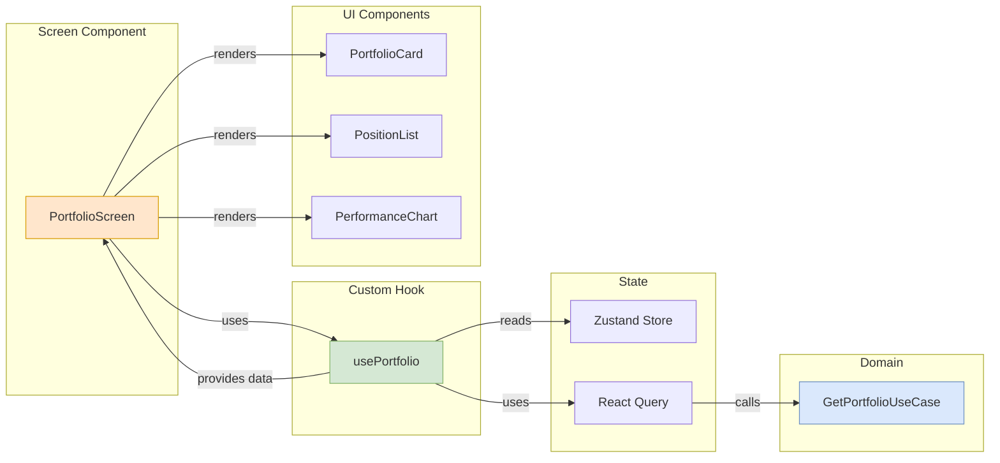

---

## 8. Module Structure & Dependency Rules

### 8.1 Dependency Flow

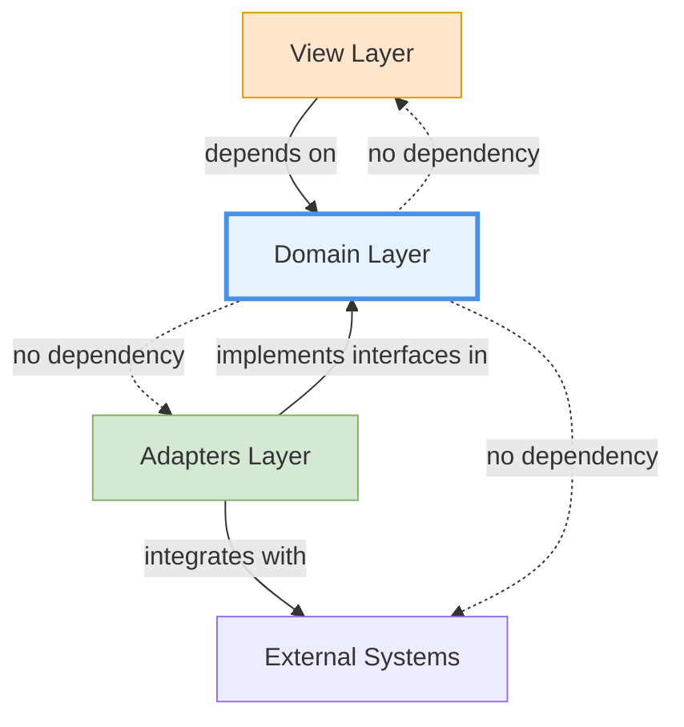

**Dependency Rules:**

| Layer | Can Depend On | Cannot Depend On |
|-------|---------------|------------------|
| View | Domain, Shared | Adapters (directly) |
| Domain | Shared (only) | View, Adapters, External |
| Adapters | Domain, Shared | View |
| Shared | Nothing | All layers |

### 8.2 Folder Structure

```
src/
├── domain/                          # Domain Layer (Business Logic)
│   ├── entities/                    # Business entities
│   │   ├── auth/
│   │   │   ├── User.ts
│   │   │   ├── Session.ts
│   │   │   └── Credentials.ts
│   │   ├── product/
│   │   │   ├── Product.ts
│   │   │   └── ProductCategory.ts
│   │   ├── portfolio/
│   │   │   ├── Portfolio.ts
│   │   │   ├── Position.ts
│   │   │   └── Transaction.ts
│   │   └── chat/
│   │       ├── Message.ts
│   │       ├── Conversation.ts
│   │       └── Manager.ts
│   ├── repositories/                # Repository interfaces
│   │   ├── IAuthRepository.ts
│   │   ├── IProductRepository.ts
│   │   ├── IPortfolioRepository.ts
│   │   └── IChatRepository.ts
│   ├── usecases/                    # Use cases
│   │   ├── auth/
│   │   │   ├── LoginUseCase.ts
│   │   │   ├── LogoutUseCase.ts
│   │   │   └── RefreshSessionUseCase.ts
│   │   ├── product/
│   │   │   ├── GetProductsUseCase.ts
│   │   │   ├── GetProductDetailsUseCase.ts
│   │   │   └── ExpressInterestUseCase.ts
│   │   ├── portfolio/
│   │   │   ├── GetPortfolioUseCase.ts
│   │   │   ├── GetPositionsUseCase.ts
│   │   │   └── GetTransactionsUseCase.ts
│   │   └── chat/
│   │       ├── SendMessageUseCase.ts
│   │       ├── GetChatHistoryUseCase.ts
│   │       └── SubscribeToMessagesUseCase.ts
│   ├── valueobjects/                # Value objects
│   │   ├── Money.ts
│   │   ├── Percentage.ts
│   │   └── DateRange.ts
│   └── services/                    # Domain services
│       ├── ValidationService.ts
│       └── CalculationService.ts
│
├── adapters/                        # Adapters Layer (Infrastructure)
│   ├── api/                         # API clients
│   │   ├── clients/
│   │   │   ├── AuthAPIClient.ts
│   │   │   ├── ProductAPIClient.ts
│   │   │   ├── PortfolioAPIClient.ts
│   │   │   └── ChatAPIClient.ts
│   │   ├── interceptors/
│   │   │   ├── AuthInterceptor.ts
│   │   │   └── ErrorInterceptor.ts
│   │   └── HttpClient.ts
│   ├── repositories/                # Repository implementations
│   │   ├── AuthRepository.ts
│   │   ├── ProductRepository.ts
│   │   ├── PortfolioRepository.ts
│   │   └── ChatRepository.ts
│   ├── storage/                     # Storage adapters
│   │   ├── AsyncStorageAdapter.ts
│   │   ├── SecureStorageAdapter.ts
│   │   └── CacheAdapter.ts
│   ├── websocket/                   # WebSocket
│   │   ├── WebSocketManager.ts
│   │   ├── MessageQueue.ts
│   │   └── ConnectionMonitor.ts
│   ├── platform/                    # Platform adapters
│   │   ├── BiometricAdapter.ts
│   │   ├── PushNotificationAdapter.ts
│   │   └── FileSystemAdapter.ts
│   └── services/                    # Infrastructure services
│       ├── AnalyticsService.ts
│       └── ErrorTrackingService.ts
│
├── view/                            # View Layer (Presentation)
│   ├── screens/                     # Screen components
│   │   ├── auth/
│   │   │   ├── LoginScreen.tsx
│   │   │   └── ForgotPasswordScreen.tsx
│   │   ├── products/
│   │   │   ├── ProductListScreen.tsx
│   │   │   └── ProductDetailsScreen.tsx
│   │   ├── portfolio/
│   │   │   ├── PortfolioScreen.tsx
│   │   │   ├── PositionListScreen.tsx
│   │   │   └── TransactionHistoryScreen.tsx
│   │   ├── chat/
│   │   │   └── ChatScreen.tsx
│   │   └── profile/
│   │       └── ProfileScreen.tsx
│   ├── components/                  # Reusable components
│   │   ├── ui/                      # Basic UI components
│   │   │   ├── Button.tsx
│   │   │   ├── Input.tsx
│   │   │   ├── Card.tsx
│   │   │   ├── Modal.tsx
│   │   │   ├── Loader.tsx
│   │   │   └── ErrorState.tsx
│   │   ├── charts/                  # Chart components
│   │   │   ├── PerformanceChart.tsx
│   │   │   └── AllocationChart.tsx
│   │   ├── chat/                    # Chat components
│   │   │   ├── MessageList.tsx
│   │   │   ├── MessageInput.tsx
│   │   │   └── ManagerStatus.tsx
│   │   └── portfolio/               # Portfolio components
│   │       ├── PositionCard.tsx
│   │       ├── TransactionItem.tsx
│   │       └── PortfolioSummary.tsx
│   ├── navigation/                  # Navigation
│   │   ├── AppNavigator.tsx
│   │   ├── TabNavigator.tsx
│   │   ├── AuthNavigator.tsx
│   │   └── DeepLinking.ts
│   ├── hooks/                       # Custom hooks
│   │   ├── useAuth.ts
│   │   ├── useProducts.ts
│   │   ├── usePortfolio.ts
│   │   ├── useChat.ts
│   │   └── useNetworkStatus.ts
│   ├── hocs/                        # Higher-order components
│   │   ├── withAuth.tsx
│   │   ├── withErrorBoundary.tsx
│   │   └── withLoading.tsx
│   └── styles/                      # Styling
│       ├── theme.ts
│       ├── colors.ts
│       └── typography.ts
│
├── shared/                          # Shared utilities
│   ├── types/                       # Common types
│   │   ├── Result.ts
│   │   ├── Either.ts
│   │   └── Maybe.ts
│   ├── utils/                       # Utility functions
│   │   ├── formatting.ts
│   │   ├── validation.ts
│   │   └── date.ts
│   ├── constants/                   # Constants
│   │   ├── API.ts
│   │   ├── Config.ts
│   │   └── Enums.ts
│   └── errors/                      # Error types
│       ├── AppError.ts
│       ├── AuthError.ts
│       ├── NetworkError.ts
│       └── ValidationError.ts
│
├── state/                           # State management
│   ├── stores/                      # Zustand stores
│   │   ├── authStore.ts
│   │   ├── navigationStore.ts
│   │   └── uiStore.ts
│   ├── queries/                     # React Query hooks
│   │   ├── useProductsQuery.ts
│   │   ├── usePortfolioQuery.ts
│   │   └── useChatQuery.ts
│   └── mutations/                   # React Query mutations
│       ├── useLoginMutation.ts
│       ├── useSendMessageMutation.ts
│       └── useExpressInterestMutation.ts
│
├── i18n/                            # Internationalization
│   ├── index.ts
│   └── locales/
│       └── ru/
│           ├── common.json
│           ├── auth.json
│           ├── products.json
│           ├── portfolio.json
│           └── chat.json
│
├── di/                              # Dependency injection
│   ├── container.ts
│   └── providers/
│       ├── AuthProvider.tsx
│       └── QueryProvider.tsx
│
└── App.tsx                          # App entry point
```

---

## 9. Scalability Considerations

### 9.1 Horizontal Scaling

**Application Scaling:**
- Stateless architecture
- Token-based authentication
- No local state dependency
- Multiple device support

**Data Scaling:**
- Pagination for all list endpoints
- Cursor-based pagination for chat
- Lazy loading for images
- Virtual scrolling for long lists

### 9.2 Performance Optimization

**Bundle Optimization:**
- Code splitting by route
- Dynamic imports for heavy components
- Tree shaking
- Bundle analyzer monitoring

**Runtime Optimization:**
- Memoization (React.memo, useMemo, useCallback)
- Virtualization for lists (FlashList)
- Image caching (react-native-fast-image)
- Animation on UI thread (Reanimated)

**Memory Management:**
- Proper cleanup in useEffect
- Event listener cleanup
- WebSocket disconnection
- Image cache management

### 9.3 Feature Scalability

**Adding New Features:**

1. **New Entity (e.g., Documents):**
   - Add entity in `domain/entities/`
   - Add repository interface in `domain/repositories/`
   - Add use cases in `domain/usecases/`
   - Add API client in `adapters/api/`
   - Add repository implementation in `adapters/repositories/`
   - Add screens in `view/screens/`
   - Add queries/mutations in `state/`

2. **New Feature Module (e.g., Notifications):**
   - Create complete vertical slice
   - No changes to existing modules
   - Clean integration

---

## 10. Testability Architecture

### 10.1 Testing Strategy

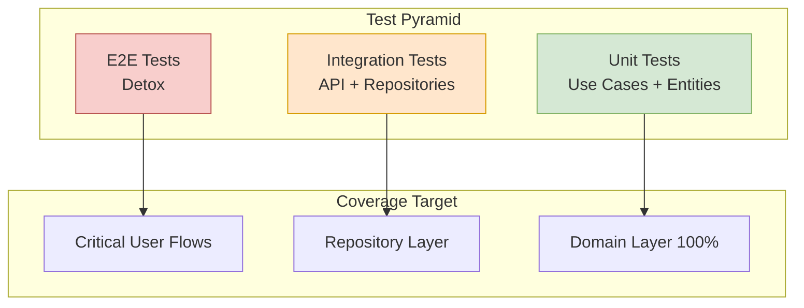

### 10.2 Testability Features

**Domain Layer:**
- Pure functions (no side effects)
- Dependency injection
- Mockable interfaces
- Framework-agnostic

**Adapters Layer:**
- Interface-based design
- Mock implementations possible
- Integration test friendly

**View Layer:**
- Component testing with React Native Testing Library
- Hook testing with @testing-library/react-hooks
- Snapshot testing for UI components

### 10.3 Testing Examples

```typescript
// Domain Layer Unit Test
describe('GetPortfolioUseCase', () => {
  let useCase: GetPortfolioUseCase;
  let mockRepository: jest.Mocked<IPortfolioRepository>;
  let mockCache: jest.Mocked<ICacheService>;
  
  beforeEach(() => {
    mockRepository = {
      getPortfolio: jest.fn(),
    };
    mockCache = {
      get: jest.fn(),
      set: jest.fn(),
    };
    useCase = new GetPortfolioUseCase(mockRepository, mockCache);
  });
  
  it('should return cached portfolio if fresh', async () => {
    const cachedPortfolio = createMockPortfolio();
    mockCache.get.mockResolvedValue(cachedPortfolio);
    
    const result = await useCase.execute('user-123');
    
    expect(result.isSuccess()).toBe(true);
    expect(result.value).toEqual(cachedPortfolio);
    expect(mockRepository.getPortfolio).not.toHaveBeenCalled();
  });
  
  it('should fetch from repository if cache is stale', async () => {
    const stalePortfolio = createMockPortfolio({ lastUpdated: oldDate });
    mockCache.get.mockResolvedValue(stalePortfolio);
    const freshPortfolio = createMockPortfolio();
    mockRepository.getPortfolio.mockResolvedValue(Result.ok(freshPortfolio));
    
    const result = await useCase.execute('user-123');
    
    expect(result.isSuccess()).toBe(true);
    expect(mockRepository.getPortfolio).toHaveBeenCalledWith('user-123');
  });
});

// View Layer Component Test
describe('PortfolioScreen', () => {
  it('should display portfolio overview', () => {
    const mockPortfolio = createMockPortfolio();
    
    const { getByText } = render(
      <PortfolioScreen portfolio={mockPortfolio} />
    );
    
    expect(getByText('Портфель')).toBeTruthy();
    expect(getByText(formatCurrency(mockPortfolio.totalValue))).toBeTruthy();
  });
  
  it('should show loading state', () => {
    const { getByTestId } = render(
      <PortfolioScreen isLoading={true} />
    );
    
    expect(getByTestId('portfolio-loading')).toBeTruthy();
  });
});
```

---

## 11. Security Architecture

### 11.1 Security Layers

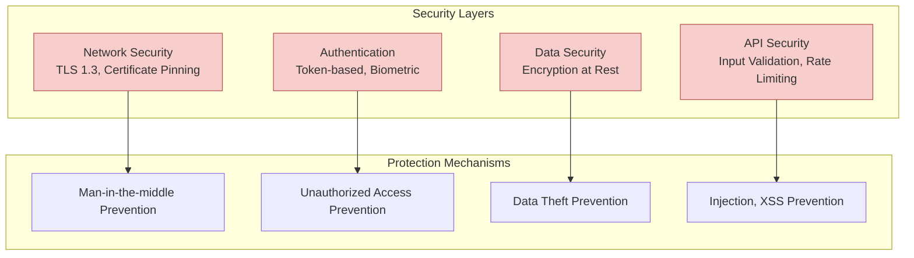

### 11.2 Secure Data Storage

| Data Type | Storage Location | Encryption | Access Control |
|-----------|-----------------|------------|----------------|
| Auth Tokens | iOS Keychain / Android Keystore | Platform-native | Biometric/Passcode |
| User Credentials | Never stored | N/A | N/A |
| Cached Portfolio | Encrypted AsyncStorage | AES-256 | App sandbox |
| Chat Messages | Encrypted AsyncStorage | AES-256 | App sandbox |
| User Preferences | AsyncStorage | Optional | App sandbox |

### 11.3 Network Security

**HTTPS/TLS Configuration:**
- TLS 1.3 mandatory
- Certificate pinning for production
- Public key pinning with backup keys
- Certificate transparency support

**Request Security:**
- Bearer token authentication
- Request signing for sensitive operations
- Request ID for tracing
- CSRF protection (via tokens)

---

## 12. ADR References

This system design supports the following Architecture Decision Records:

1. **ADR-001: Technology Stack Selection** (to be created)
2. **ADR-002: Clean Architecture Adoption** (to be created)
3. **ADR-003: State Management with Zustand** (to be created)
4. **ADR-004: WebSocket Implementation** (to be created)
5. **ADR-005: Offline Strategy** (to be created)

---

## 13. Risks & Mitigation

### 13.1 Architecture Risks

| Risk | Impact | Probability | Mitigation |
|------|--------|-------------|------------|
| Over-engineering for MVP | Medium | Medium | Start with minimal layers, add complexity as needed |
| Backend API changes | High | High | Repository pattern isolates changes, API versioning |
| WebSocket instability | High | Medium | Fallback to REST polling, robust reconnection |
| Performance degradation with large datasets | Medium | Medium | Pagination, virtualization, lazy loading |
| State synchronization complexity | Medium | Medium | React Query handles most cases, clear offline strategy |

### 13.2 Mitigation Strategies

1. **Incremental Architecture:**
   - Start with minimal viable architecture
   - Add complexity only when needed
   - Refactor based on actual usage patterns

2. **Defensive Programming:**
   - Comprehensive error handling
   - Graceful degradation
   - Retry mechanisms

3. **Monitoring & Observability:**
   - Error tracking (Sentry)
   - Performance monitoring
   - User behavior analytics

---

## 14. Next Steps

### 14.1 Immediate Actions

1. **Create ADR documents** for key decisions
2. **Set up project structure** following folder layout
3. **Configure dependency injection** container
4. **Implement domain entities** for MVP features
5. **Create repository interfaces** for MVP features

### 14.2 Architecture Evolution

**Phase 1 (MVP):**
- Core domain layer
- Basic API integration
- Essential state management

**Phase 2 (V1.1):**
- Add WebSocket layer
- Implement caching strategy
- Enhance offline support

**Phase 3 (V2.0):**
- Add advanced features (Documents)
- Performance optimization
- Architecture refinement based on learnings

---

## 15. Appendix

### 15.1 Technology Stack Summary

| Layer | Technology | Version | Purpose |
|-------|------------|---------|---------|
| **Framework** | React Native | 0.73+ | Cross-platform mobile |
| **Language** | TypeScript | 5.0+ | Type safety |
| **State Management** | Zustand | 4.5+ | Client state |
| **Server State** | React Query | 5.0+ | API caching |
| **Navigation** | React Navigation | 6.0+ | Routing |
| **Styling** | Tailwind CSS / twrnc | Latest | Styling |
| **HTTP Client** | Axios | 1.6+ | API calls |
| **WebSocket** | Socket.io Client | 4.7+ | Real-time |
| **Secure Storage** | react-native-keychain | 8.1+ | Token storage |
| **Biometrics** | react-native-biometrics | 3.0+ | Face ID/Touch ID |
| **Push Notifications** | @react-native-firebase/messaging | 18.0+ | Push notifications |
| **Charts** | react-native-chart-kit | 6.12+ | Data visualization |
| **Localization** | react-i18next | 14.0+ | i18n |
| **Testing** | Jest + React Native Testing Library | Latest | Testing |
| **Error Tracking** | Sentry | Latest | Error monitoring |

### 15.2 Glossary

| Term | Definition |
|------|------------|
| **Clean Architecture** | Architectural pattern that separates concerns into layers with dependency inversion |
| **Use Case** | Application-specific business rule that orchestrates entities |
| **Repository** | Pattern that abstracts data access, providing collection-like interface |
| **Entity** | Business object with identity and behavior |
| **Value Object** | Immutable object defined by its attributes |
| **Adapter** | Component that converts interface of a class into another interface |
| **Dependency Injection** | Design pattern where dependencies are provided rather than created |

---

## Document History

| Version | Date | Author | Changes |
|---------|------|--------|---------|
| 1.0 | 2026-03-31 | Software Architect | Initial system design |

---

*Document created by Software Architect Agent*  
*Last updated: 2026-03-31*