# System Architecture Design

## Document Information
- **Project:** Asset Management Client App
- **Version:** 1.0
- **Date:** 2026-03-31
- **Author:** Software Architect Agent
- **Status:** Draft

---

## 1. Architecture Overview

### 1.1 Architectural Pattern

**Selected Pattern: Clean Architecture with Feature-Based Modularization**

Clean Architecture provides clear separation of concerns, making the codebase:
- **Testable:** Business logic can be tested independently of UI and external services
- **Maintainable:** Changes in one layer don't affect others
- **Scalable:** New features can be added without modifying existing code
- **Framework Independent:** Business logic doesn't depend on React Native specifics

### 1.2 Layer Definition

```
┌─────────────────────────────────────────────────────────────────────┐
│                        PRESENTATION LAYER                           │
│  ┌─────────────────────────────────────────────────────────────┐   │
│  │  UI Components  │  Screens  │  Navigation  │  View Models   │   │
│  └─────────────────────────────────────────────────────────────┘   │
└─────────────────────────────────────────────────────────────────────┘
                                 ↓ ↑
┌─────────────────────────────────────────────────────────────────────┐
│                          DOMAIN LAYER                               │
│  ┌─────────────────────────────────────────────────────────────┐   │
│  │   Entities    │   Use Cases   │   Repository Interfaces     │   │
│  └─────────────────────────────────────────────────────────────┘   │
└─────────────────────────────────────────────────────────────────────┘
                                 ↓ ↑
┌─────────────────────────────────────────────────────────────────────┐
│                          DATA LAYER                                 │
│  ┌─────────────────────────────────────────────────────────────┐   │
│  │  API Clients  │  Repositories  │  Data Sources  │  Mappers  │   │
│  └─────────────────────────────────────────────────────────────┘   │
└─────────────────────────────────────────────────────────────────────┘
                                 ↓ ↑
┌─────────────────────────────────────────────────────────────────────┐
│                       INFRASTRUCTURE LAYER                          │
│  ┌───────────────────────────────────────────────────────────────┐ │
│  │  Network  │  Storage  │  Push Notifications  │  Analytics     │ │
│  └───────────────────────────────────────────────────────────────┘ │
└─────────────────────────────────────────────────────────────────────┘
```

### 1.3 Layer Responsibilities

| Layer | Responsibility | Dependencies |
|-------|---------------|--------------|
| **Presentation** | UI rendering, user interactions, navigation | Domain Layer |
| **Domain** | Business logic, entities, use cases | None (pure TypeScript) |
| **Data** | Data operations, API calls, caching | Domain Layer |
| **Infrastructure** | External services, device features | All layers |

---

## 2. C4 Architecture Diagrams

### 2.1 Context Diagram (Level 1)

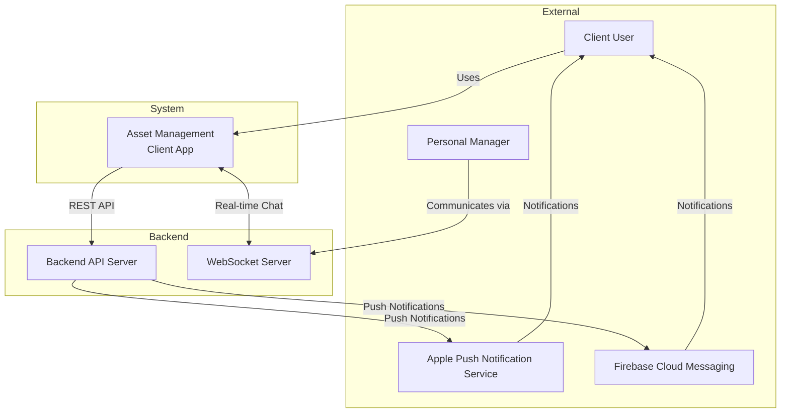
```mermaid
graph TB
    subgraph External
        User[Client User]
        Manager[Personal Manager]
        APNS[Apple Push Notification Service]
        FCM[Firebase Cloud Messaging]
    end
    
    subgraph System
        App[Asset Management<br/>Client App]
    end
    
    subgraph Backend
        API[Backend API Server]
        WS[WebSocket Server]
    end
    
    User -->|Uses| App
    Manager -->|Communicates via| WS
    App -->|REST API| API
    App <-->|Real-time Chat| WS
    API -->|Push Notifications| APNS
    API -->|Push Notifications| FCM
    APNS -->|Notifications| User
    FCM -->|Notifications| User
```

**System Context Description:**
- **Client User:** Investors using the mobile app to view portfolio and communicate with managers
- **Personal Manager:** Company employee communicating with clients through the system
- **Backend API:** RESTful API providing business data (products, portfolio, user info)
- **WebSocket Server:** Real-time messaging infrastructure for chat functionality
- **Push Notification Services:** APNs (iOS) and FCM (Android) for push notifications

### 2.2 Container Diagram (Level 2)

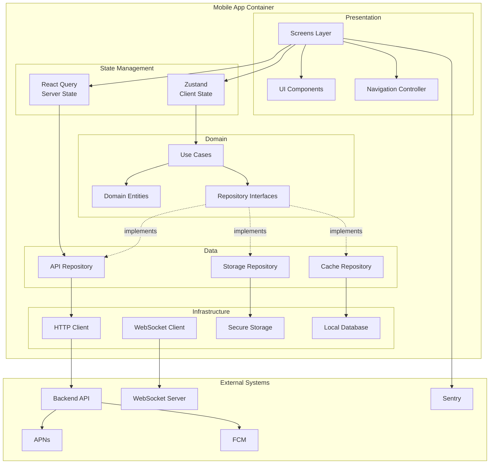
```mermaid
graph TB
    subgraph "Mobile App Container"
        subgraph "Presentation"
            Screens[Screens Layer]
            Components[UI Components]
            Navigation[Navigation Controller]
        end
        
        subgraph "State Management"
            ReactQuery[React Query<br/>Server State]
            Zustand[Zustand<br/>Client State]
        end
        
        subgraph "Domain"
            Entities[Domain Entities]
            UseCases[Use Cases]
            Repos[Repository Interfaces]
        end
        
        subgraph "Data"
            APIRepo[API Repository]
            CacheRepo[Cache Repository]
            StorageRepo[Storage Repository]
        end
        
        subgraph "Infrastructure"
            HTTPClient[HTTP Client]
            WSClient[WebSocket Client]
            SecureStore[Secure Storage]
            LocalDB[Local Database]
        end
    end
    
    subgraph "External Systems"
        Backend[Backend API]
        WSServer[WebSocket Server]
        APNS[APNs]
        FCM[FCM]
        Sentry[Sentry]
    end
    
    Screens --> Components
    Screens --> Navigation
    Screens --> ReactQuery
    Screens --> Zustand
    
    ReactQuery --> APIRepo
    Zustand --> UseCases
    
    UseCases --> Entities
    UseCases --> Repos
    
    Repos -.->|implements| APIRepo
    Repos -.->|implements| CacheRepo
    Repos -.->|implements| StorageRepo
    
    APIRepo --> HTTPClient
    CacheRepo --> LocalDB
    StorageRepo --> SecureStore
    
    HTTPClient --> Backend
    WSClient --> WSServer
    
    Backend --> APNS
    Backend --> FCM
    
    Screens --> Sentry
```

### 2.3 Component Diagram (Level 3) - Mobile App

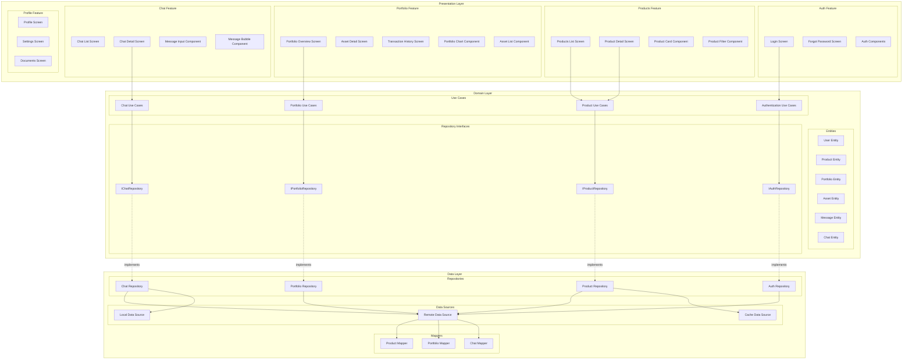
```mermaid
graph TB
    subgraph "Presentation Layer"
        subgraph "Auth Feature"
            LoginScreen[Login Screen]
            ForgotPasswordScreen[Forgot Password Screen]
            AuthComponents[Auth Components]
        end
        
        subgraph "Products Feature"
            ProductsListScreen[Products List Screen]
            ProductDetailScreen[Product Detail Screen]
            ProductCard[Product Card Component]
            ProductFilter[Product Filter Component]
        end
        
        subgraph "Portfolio Feature"
            PortfolioScreen[Portfolio Overview Screen]
            AssetDetailScreen[Asset Detail Screen]
            TransactionHistory[Transaction History Screen]
            PortfolioChart[Portfolio Chart Component]
            AssetList[Asset List Component]
        end
        
        subgraph "Chat Feature"
            ChatListScreen[Chat List Screen]
            ChatDetailScreen[Chat Detail Screen]
            MessageInput[Message Input Component]
            MessageBubble[Message Bubble Component]
        end
        
        subgraph "Profile Feature"
            ProfileScreen[Profile Screen]
            SettingsScreen[Settings Screen]
            DocumentsScreen[Documents Screen]
        end
    end
    
    subgraph "Domain Layer"
        subgraph "Entities"
            User[User Entity]
            Product[Product Entity]
            Portfolio[Portfolio Entity]
            Asset[Asset Entity]
            Message[Message Entity]
            Chat[Chat Entity]
        end
        
        subgraph "Use Cases"
            AuthUseCases[Authentication Use Cases]
            ProductUseCases[Product Use Cases]
            PortfolioUseCases[Portfolio Use Cases]
            ChatUseCases[Chat Use Cases]
        end
        
        subgraph "Repository Interfaces"
            IAuthRepo[IAuthRepository]
            IProductRepo[IProductRepository]
            IPortfolioRepo[IPortfolioRepository]
            IChatRepo[IChatRepository]
        end
    end
    
    subgraph "Data Layer"
        subgraph "Repositories"
            AuthRepository[Auth Repository]
            ProductRepository[Product Repository]
            PortfolioRepository[Portfolio Repository]
            ChatRepository[Chat Repository]
        end
        
        subgraph "Data Sources"
            RemoteDataSource[Remote Data Source]
            LocalDataSource[Local Data Source]
            CacheDataSource[Cache Data Source]
        end
        
        subgraph "Mappers"
            ProductMapper[Product Mapper]
            PortfolioMapper[Portfolio Mapper]
            ChatMapper[Chat Mapper]
        end
    end
    
    LoginScreen --> AuthUseCases
    ProductsListScreen --> ProductUseCases
    ProductDetailScreen --> ProductUseCases
    PortfolioScreen --> PortfolioUseCases
    ChatDetailScreen --> ChatUseCases
    
    AuthUseCases --> IAuthRepo
    ProductUseCases --> IProductRepo
    PortfolioUseCases --> IPortfolioRepo
    ChatUseCases --> IChatRepo
    
    IAuthRepo -.->|implements| AuthRepository
    IProductRepo -.->|implements| ProductRepository
    IPortfolioRepo -.->|implements| PortfolioRepository
    IChatRepo -.->|implements| ChatRepository
    
    AuthRepository --> RemoteDataSource
    ProductRepository --> RemoteDataSource
    ProductRepository --> CacheDataSource
    PortfolioRepository --> RemoteDataSource
    ChatRepository --> RemoteDataSource
    ChatRepository --> LocalDataSource
    
    RemoteDataSource --> ProductMapper
    RemoteDataSource --> PortfolioMapper
    RemoteDataSource --> ChatMapper
```

---

## 3. Component Boundaries

### 3.1 Feature-Based Module Structure

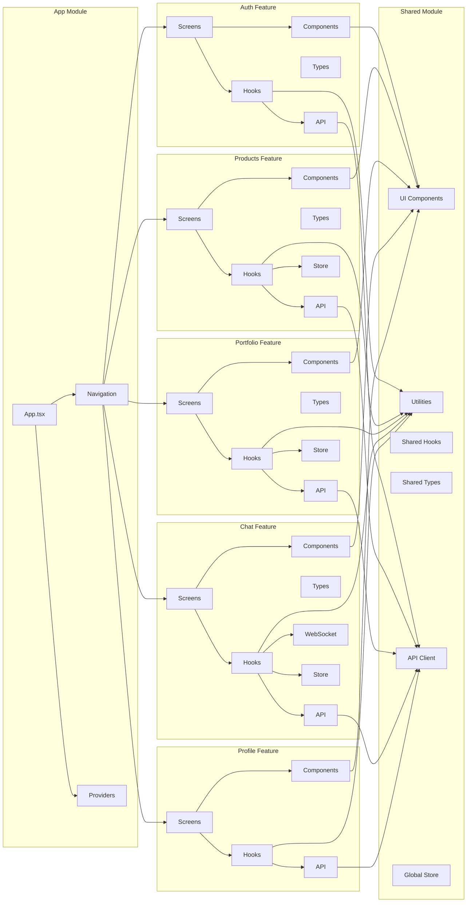
```mermaid
graph LR
    subgraph "App Module"
        App[App.tsx]
        Nav[Navigation]
        Providers[Providers]
    end
    
    subgraph "Auth Feature"
        A_Screens[Screens]
        A_Components[Components]
        A_Hooks[Hooks]
        A_Types[Types]
        A_Api[API]
    end
    
    subgraph "Products Feature"
        P_Screens[Screens]
        P_Components[Components]
        P_Hooks[Hooks]
        P_Types[Types]
        P_Api[API]
        P_Store[Store]
    end
    
    subgraph "Portfolio Feature"
        PF_Screens[Screens]
        PF_Components[Components]
        PF_Hooks[Hooks]
        PF_Types[Types]
        PF_Api[API]
        PF_Store[Store]
    end
    
    subgraph "Chat Feature"
        C_Screens[Screens]
        C_Components[Components]
        C_Hooks[Hooks]
        C_Types[Types]
        C_Api[API]
        C_WS[WebSocket]
        C_Store[Store]
    end
    
    subgraph "Profile Feature"
        PR_Screens[Screens]
        PR_Components[Components]
        PR_Hooks[Hooks]
        PR_Api[API]
    end
    
    subgraph "Shared Module"
        S_UI[UI Components]
        S_Utils[Utilities]
        S_Hooks[Shared Hooks]
        S_Types[Shared Types]
        S_Api[API Client]
        S_Store[Global Store]
    end
    
    App --> Nav
    App --> Providers
    
    Nav --> A_Screens
    Nav --> P_Screens
    Nav --> PF_Screens
    Nav --> C_Screens
    Nav --> PR_Screens
    
    A_Screens --> A_Components
    A_Screens --> A_Hooks
    A_Hooks --> A_Api
    
    P_Screens --> P_Components
    P_Screens --> P_Hooks
    P_Hooks --> P_Api
    P_Hooks --> P_Store
    
    PF_Screens --> PF_Components
    PF_Screens --> PF_Hooks
    PF_Hooks --> PF_Api
    PF_Hooks --> PF_Store
    
    C_Screens --> C_Components
    C_Screens --> C_Hooks
    C_Hooks --> C_Api
    C_Hooks --> C_WS
    C_Hooks --> C_Store
    
    PR_Screens --> PR_Components
    PR_Screens --> PR_Hooks
    PR_Hooks --> PR_Api
    
    A_Components --> S_UI
    P_Components --> S_UI
    PF_Components --> S_UI
    C_Components --> S_UI
    PR_Components --> S_UI
    
    A_Api --> S_Api
    P_Api --> S_Api
    PF_Api --> S_Api
    C_Api --> S_Api
    PR_Api --> S_Api
    
    A_Hooks --> S_Utils
    P_Hooks --> S_Utils
    PF_Hooks --> S_Utils
    C_Hooks --> S_Utils
    PR_Hooks --> S_Utils
```

### 3.2 Module Dependency Rules

| Module | Can Depend On | Cannot Depend On |
|--------|---------------|------------------|
| **App** | All features, Shared | None |
| **Auth** | Shared | Other features |
| **Products** | Shared | Auth, Portfolio, Chat, Profile |
| **Portfolio** | Shared | Auth, Products, Chat, Profile |
| **Chat** | Shared | Auth, Products, Portfolio, Profile |
| **Profile** | Shared | Auth, Products, Portfolio, Chat |
| **Shared** | External libraries | Feature modules |

---

## 4. Data Flow Design

### 4.1 Data Flow Overview

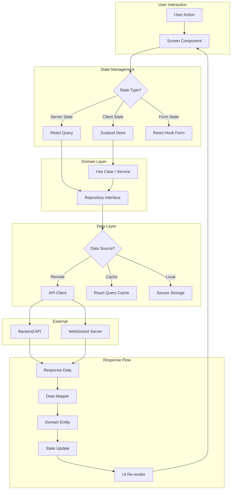
```mermaid
flowchart TD
    subgraph "User Interaction"
        A[User Action] --> B[Screen Component]
    end
    
    subgraph "State Management"
        B --> C{State Type?}
        C -->|Server State| D[React Query]
        C -->|Client State| E[Zustand Store]
        C -->|Form State| F[React Hook Form]
    end
    
    subgraph "Domain Layer"
        D --> G[Repository Interface]
        E --> H[Use Case / Service]
        H --> G
    end
    
    subgraph "Data Layer"
        G --> I{Data Source?}
        I -->|Remote| J[API Client]
        I -->|Cache| K[React Query Cache]
        I -->|Local| L[Secure Storage]
    end
    
    subgraph "External"
        J --> M[Backend API]
        J --> N[WebSocket Server]
    end
    
    subgraph "Response Flow"
        M --> O[Response Data]
        N --> O
        O --> P[Data Mapper]
        P --> Q[Domain Entity]
        Q --> R[State Update]
        R --> S[UI Re-render]
        S --> B
    end
```

### 4.2 Authentication Data Flow

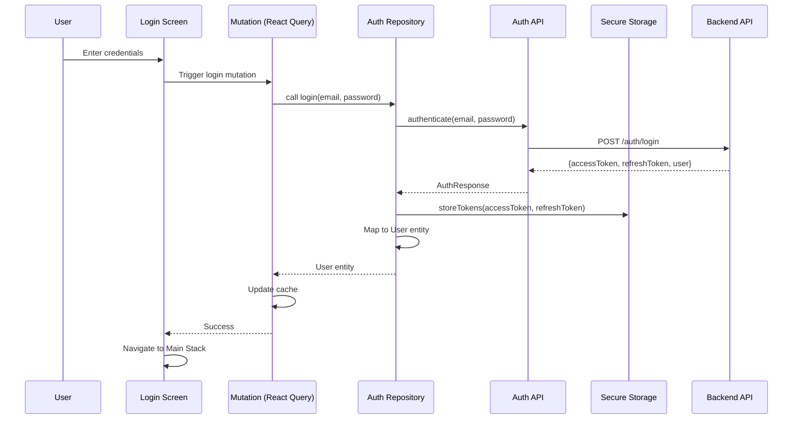
```mermaid
sequenceDiagram
    participant U as User
    participant S as Login Screen
    participant MQ as Mutation (React Query)
    participant R as Auth Repository
    participant A as Auth API
    participant SS as Secure Storage
    participant B as Backend API
    
    U->>S: Enter credentials
    S->>MQ: Trigger login mutation
    MQ->>R: call login(email, password)
    R->>A: authenticate(email, password)
    A->>B: POST /auth/login
    B-->>A: {accessToken, refreshToken, user}
    A-->>R: AuthResponse
    R->>SS: storeTokens(accessToken, refreshToken)
    R->>R: Map to User entity
    R-->>MQ: User entity
    MQ->>MQ: Update cache
    MQ-->>S: Success
    S->>S: Navigate to Main Stack
```

### 4.3 Product List Data Flow

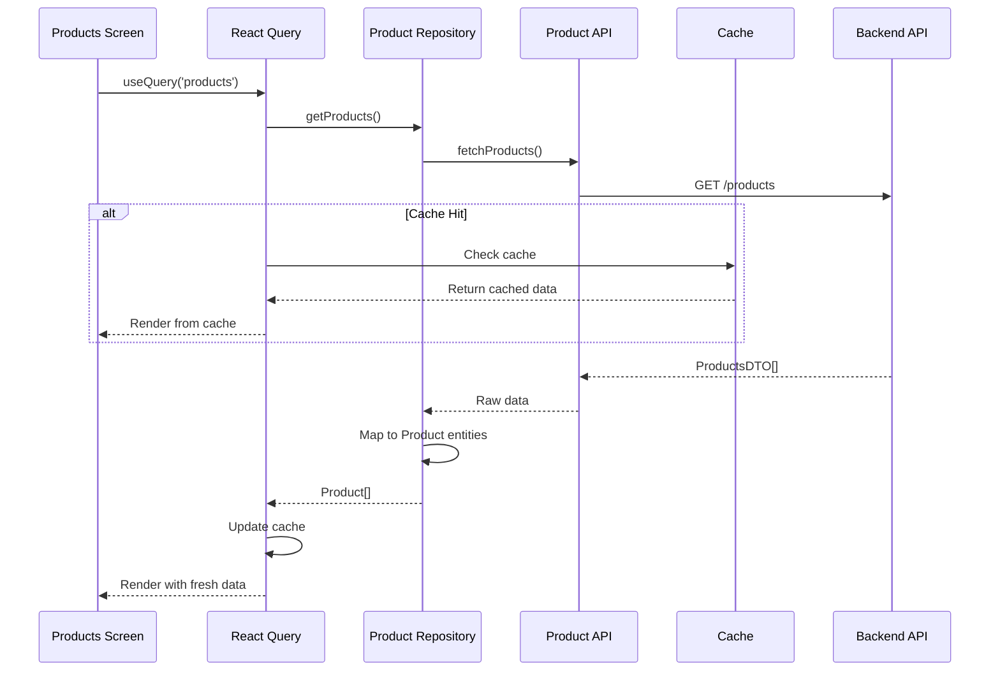
```mermaid
sequenceDiagram
    participant S as Products Screen
    participant Q as React Query
    participant R as Product Repository
    participant A as Product API
    participant C as Cache
    participant B as Backend API
    
    S->>Q: useQuery('products')
    Q->>R: getProducts()
    R->>A: fetchProducts()
    A->>B: GET /products
    
    alt Cache Hit
        Q->>C: Check cache
        C-->>Q: Return cached data
        Q-->>S: Render from cache
    end
    
    B-->>A: ProductsDTO[]
    A-->>R: Raw data
    R->>R: Map to Product entities
    R-->>Q: Product[]
    Q->>Q: Update cache
    Q-->>S: Render with fresh data
```

### 4.4 Real-time Chat Data Flow

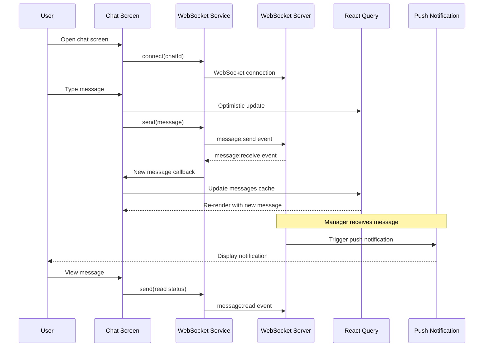
```mermaid
sequenceDiagram
    participant U as User
    participant S as Chat Screen
    participant WS as WebSocket Service
    participant W as WebSocket Server
    participant Q as React Query
    participant P as Push Notification
    
    U->>S: Open chat screen
    S->>WS: connect(chatId)
    WS->>W: WebSocket connection
    
    U->>S: Type message
    S->>Q: Optimistic update
    S->>WS: send(message)
    WS->>W: message:send event
    
    W-->>WS: message:receive event
    WS->>S: New message callback
    S->>Q: Update messages cache
    Q-->>S: Re-render with new message
    
    Note over W,P: Manager receives message
    W->>P: Trigger push notification
    P-->>U: Display notification
    
    U->>S: View message
    S->>WS: send(read status)
    WS->>W: message:read event
```

### 4.5 Portfolio Real-time Updates Flow

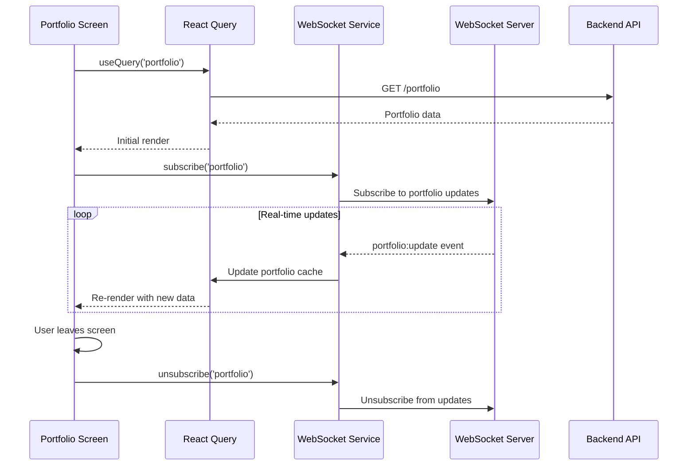
```mermaid
sequenceDiagram
    participant S as Portfolio Screen
    participant Q as React Query
    participant WS as WebSocket Service
    participant W as WebSocket Server
    participant B as Backend API
    
    S->>Q: useQuery('portfolio')
    Q->>B: GET /portfolio
    B-->>Q: Portfolio data
    Q-->>S: Initial render
    
    S->>WS: subscribe('portfolio')
    WS->>W: Subscribe to portfolio updates
    
    loop Real-time updates
        W-->>WS: portfolio:update event
        WS->>Q: Update portfolio cache
        Q-->>S: Re-render with new data
    end
    
    S->>S: User leaves screen
    S->>WS: unsubscribe('portfolio')
    WS->>W: Unsubscribe from updates
```

---

## 5. State Management Architecture

### 5.1 State Categories

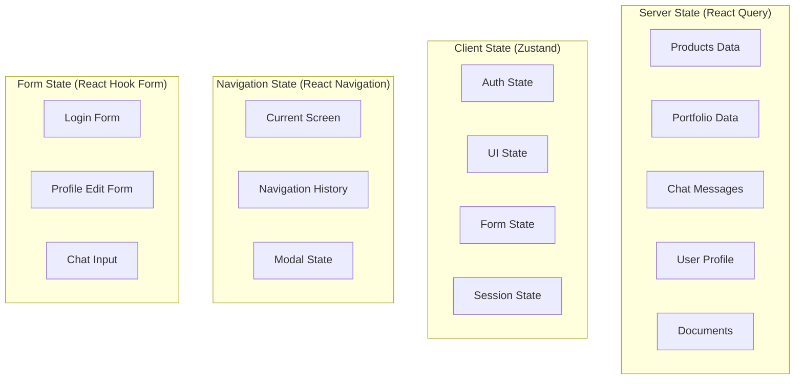
```mermaid
graph TB
    subgraph "Server State (React Query)"
        SS1[Products Data]
        SS2[Portfolio Data]
        SS3[Chat Messages]
        SS4[User Profile]
        SS5[Documents]
    end
    
    subgraph "Client State (Zustand)"
        CS1[Auth State]
        CS2[UI State]
        CS3[Form State]
        CS4[Session State]
    end
    
    subgraph "Navigation State (React Navigation)"
        NS1[Current Screen]
        NS2[Navigation History]
        NS3[Modal State]
    end
    
    subgraph "Form State (React Hook Form)"
        FS1[Login Form]
        FS2[Profile Edit Form]
        FS3[Chat Input]
    end
```

### 5.2 State Management Decision Matrix

| Data Type | State Solution | Rationale |
|-----------|---------------|-----------|
| Products | React Query | Server data, cached, auto-refetch |
| Portfolio | React Query | Server data, real-time updates via WebSocket |
| Messages | React Query + WebSocket | Server data + real-time sync |
| User Profile | React Query | Server data, cached |
| Auth Tokens | Zustand + SecureStore | Client state, persistent, secure |
| Session Timer | Zustand | Client state, ephemeral |
| UI State (modals, etc.) | Zustand | Client state, ephemeral |
| Form Data | React Hook Form | Form-specific, validation |
| Favorites | Zustand (local) + React Query (sync) | Optimistic updates + server sync |

### 5.3 React Query Configuration

```typescript
// Query Client Configuration
const queryClient = new QueryClient({
  defaultOptions: {
    queries: {
      staleTime: 5 * 60 * 1000,      // 5 minutes
      cacheTime: 10 * 60 * 1000,     // 10 minutes
      retry: 2,
      retryDelay: (attemptIndex) => Math.min(1000 * 2 ** attemptIndex, 30000),
      refetchOnWindowFocus: false,
      refetchOnReconnect: true,
    },
    mutations: {
      retry: 1,
    },
  },
});
```

### 5.4 Zustand Stores Architecture

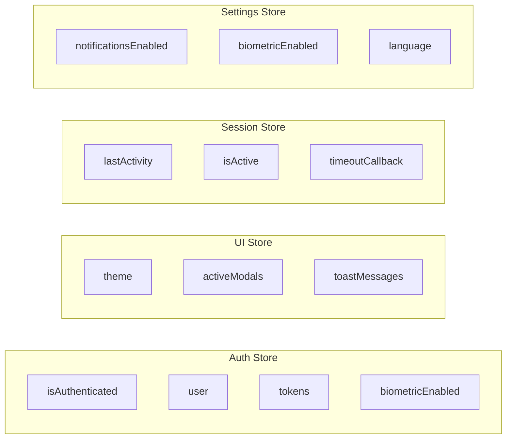
```mermaid
graph LR
    subgraph "Auth Store"
        AS_isAuthenticated[isAuthenticated]
        AS_user[user]
        AS_tokens[tokens]
        AS_biometricEnabled[biometricEnabled]
    end
    
    subgraph "UI Store"
        US_theme[theme]
        US_modals[activeModals]
        US_toasts[toastMessages]
    end
    
    subgraph "Session Store"
        SS_lastActivity[lastActivity]
        SS_isActive[isActive]
        SS_timeoutCallback[timeoutCallback]
    end
    
    subgraph "Settings Store"
        ST_notifications[notificationsEnabled]
        ST_biometric[biometricEnabled]
        ST_language[language]
    end
```

---

## 6. Navigation Architecture

### 6.1 Navigation Flow Diagram

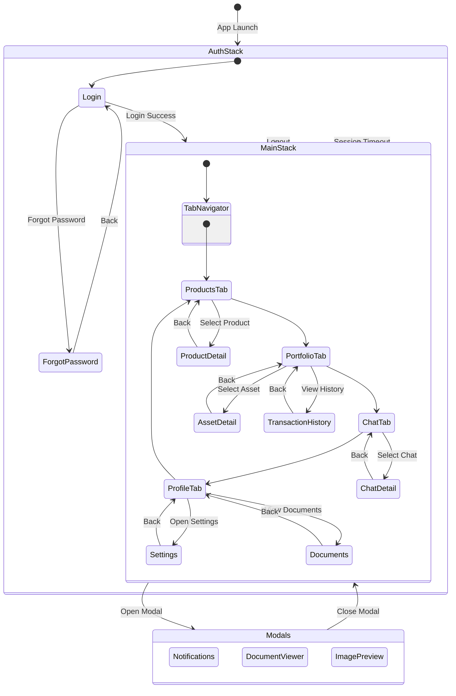
```mermaid
stateDiagram-v2
    [*] --> AuthStack: App Launch
    
    state AuthStack {
        [*] --> Login
        Login --> ForgotPassword: Forgot Password
        ForgotPassword --> Login: Back
        Login --> MainStack: Login Success
    }
    
    state MainStack {
        [*] --> TabNavigator
        
        state TabNavigator {
            [*] --> ProductsTab
            ProductsTab --> PortfolioTab
            PortfolioTab --> ChatTab
            ChatTab --> ProfileTab
            ProfileTab --> ProductsTab
        }
        
        ProductsTab --> ProductDetail: Select Product
        ProductDetail --> ProductsTab: Back
        
        PortfolioTab --> AssetDetail: Select Asset
        PortfolioTab --> TransactionHistory: View History
        AssetDetail --> PortfolioTab: Back
        TransactionHistory --> PortfolioTab: Back
        
        ChatTab --> ChatDetail: Select Chat
        ChatDetail --> ChatTab: Back
        
        ProfileTab --> Settings: Open Settings
        ProfileTab --> Documents: View Documents
        Settings --> ProfileTab: Back
        Documents --> ProfileTab: Back
    }
    
    MainStack --> AuthStack: Logout
    MainStack --> AuthStack: Session Timeout
    
    state Modals {
        Notifications
        DocumentViewer
        ImagePreview
    }
    
    MainStack --> Modals: Open Modal
    Modals --> MainStack: Close Modal
```

### 6.2 Deep Linking Architecture

```mermaid
graph LR
    subgraph "Push Notification Links"
        PN1[Chat Message] -->|deep link| DL1[/chat/:chatId]
        PN2[Portfolio Update] -->|deep link| DL2[/portfolio]
        PN3[New Product] -->|deep link| DL3[/products/:productId]
    end
    
    subgraph "Deep Link Handler"
        DL1 --> Handler[Navigation Handler]
        DL2 --> Handler
        DL3 --> Handler
    end
    
    subgraph "Navigation Actions"
        Handler --> NA1[Navigate to Chat]
        Handler --> NA2[Navigate to Portfolio]
        Handler --> NA3[Navigate to Product Detail]
    end
    
    subgraph "Auth Check"
        NA1 --> AC{Authenticated?}
        NA2 --> AC
        NA3 --> AC
        AC -->|Yes| Nav[Navigate]
        AC -->|No| Login[Show Login Screen]
        Login --> Nav
    end
```

---

## 7. Security Architecture

### 7.1 Security Layers

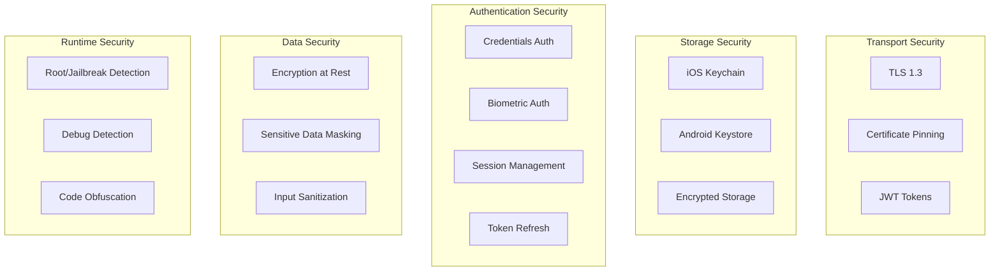
```mermaid
graph TB
    subgraph "Transport Security"
        TLS[TLS 1.3]
        CP[Certificate Pinning]
        JWT[JWT Tokens]
    end
    
    subgraph "Storage Security"
        KC[iOS Keychain]
        KS[Android Keystore]
        ES[Encrypted Storage]
    end
    
    subgraph "Authentication Security"
        Cred[Credentials Auth]
        Bio[Biometric Auth]
        Session[Session Management]
        Refresh[Token Refresh]
    end
    
    subgraph "Data Security"
        Enc[Encryption at Rest]
        Mask[Sensitive Data Masking]
        Sanitize[Input Sanitization]
    end
    
    subgraph "Runtime Security"
        Root[Root/Jailbreak Detection]
        Debug[Debug Detection]
        Obfuscate[Code Obfuscation]
    end
```

### 7.2 Token Management Flow

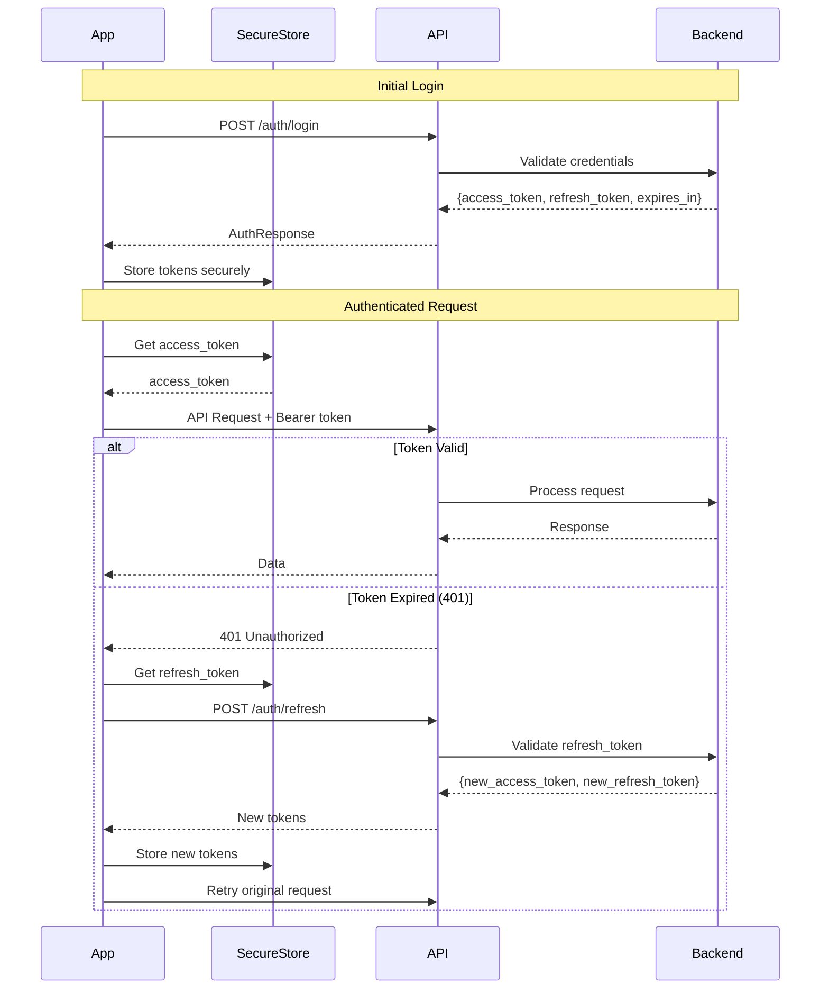
```mermaid
sequenceDiagram
    participant App
    participant SecureStore
    participant API
    participant Backend
    
    Note over App,Backend: Initial Login
    App->>API: POST /auth/login
    API->>Backend: Validate credentials
    Backend-->>API: {access_token, refresh_token, expires_in}
    API-->>App: AuthResponse
    App->>SecureStore: Store tokens securely
    
    Note over App,Backend: Authenticated Request
    App->>SecureStore: Get access_token
    SecureStore-->>App: access_token
    App->>API: API Request + Bearer token
    
    alt Token Valid
        API->>Backend: Process request
        Backend-->>API: Response
        API-->>App: Data
    else Token Expired (401)
        API-->>App: 401 Unauthorized
        App->>SecureStore: Get refresh_token
        App->>API: POST /auth/refresh
        API->>Backend: Validate refresh_token
        Backend-->>API: {new_access_token, new_refresh_token}
        API-->>App: New tokens
        App->>SecureStore: Store new tokens
        App->>API: Retry original request
    end
```

### 7.3 Session Timeout Implementation

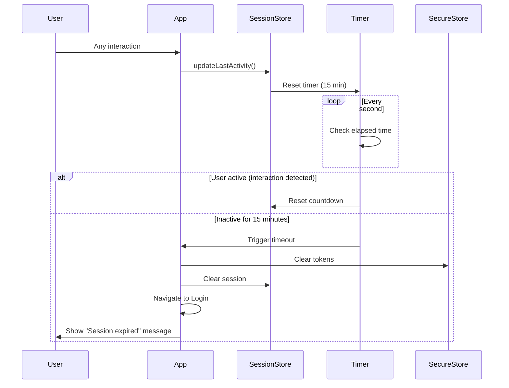
```mermaid
sequenceDiagram
    participant User
    participant App
    participant SessionStore
    participant Timer
    participant SecureStore
    
    User->>App: Any interaction
    App->>SessionStore: updateLastActivity()
    SessionStore->>Timer: Reset timer (15 min)
    
    loop Every second
        Timer->>Timer: Check elapsed time
    end
    
    alt User active (interaction detected)
        Timer->>SessionStore: Reset countdown
    else Inactive for 15 minutes
        Timer->>App: Trigger timeout
        App->>SecureStore: Clear tokens
        App->>SessionStore: Clear session
        App->>App: Navigate to Login
        App->>User: Show "Session expired" message
    end
```

---

## 8. Error Handling Architecture

### 8.1 Error Handling Flow

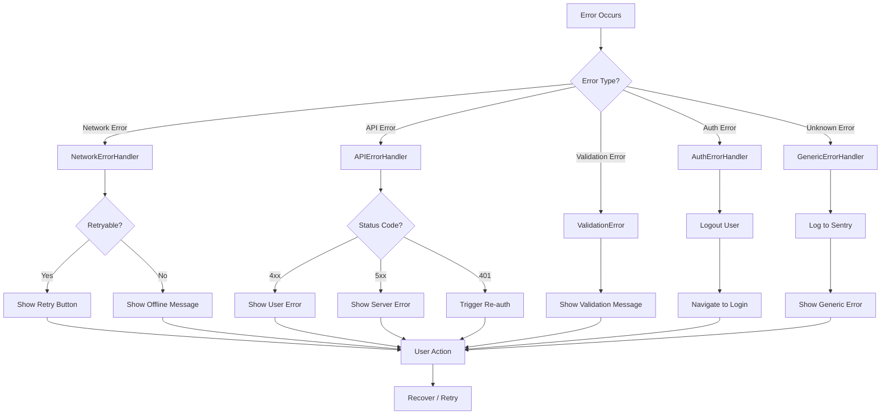
```mermaid
flowchart TD
    A[Error Occurs] --> B{Error Type?}
    
    B -->|Network Error| C[NetworkErrorHandler]
    B -->|API Error| D[APIErrorHandler]
    B -->|Validation Error| E[ValidationError]
    B -->|Auth Error| F[AuthErrorHandler]
    B -->|Unknown Error| G[GenericErrorHandler]
    
    C --> H{Retryable?}
    H -->|Yes| I[Show Retry Button]
    H -->|No| J[Show Offline Message]
    
    D --> K{Status Code?}
    K -->|4xx| L[Show User Error]
    K -->|5xx| M[Show Server Error]
    K -->|401| N[Trigger Re-auth]
    
    E --> O[Show Validation Message]
    
    F --> P[Logout User]
    P --> Q[Navigate to Login]
    
    G --> R[Log to Sentry]
    R --> S[Show Generic Error]
    
    I --> T[User Action]
    J --> T
    L --> T
    M --> T
    N --> T
    O --> T
    Q --> T
    S --> T
    
    T --> U[Recover / Retry]
```

### 8.2 Error Categories and Handling

| Error Category | HTTP Status | User Message | Action |
|---------------|-------------|--------------|--------|
| Network Error | N/A | "No internet connection" | Show retry button |
| Authentication Error | 401 | "Session expired" | Redirect to login |
| Authorization Error | 403 | "Access denied" | Show error, logout |
| Not Found | 404 | "Resource not found" | Show error, navigate back |
| Validation Error | 400 | Field-specific message | Show inline error |
| Server Error | 500-503 | "Server error, try later" | Show retry button |
| Rate Limit | 429 | "Too many requests" | Show countdown |

---

## 9. Performance Optimization Architecture

### 9.1 Performance Strategy Diagram

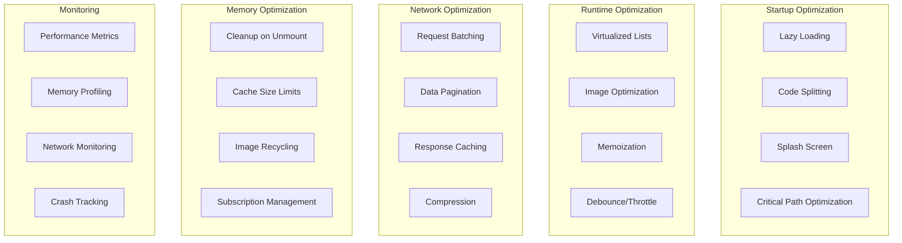
```mermaid
graph TB
    subgraph "Startup Optimization"
        SO1[Lazy Loading]
        SO2[Code Splitting]
        SO3[Splash Screen]
        SO4[Critical Path Optimization]
    end
    
    subgraph "Runtime Optimization"
        RO1[Virtualized Lists]
        RO2[Image Optimization]
        RO3[Memoization]
        RO4[Debounce/Throttle]
    end
    
    subgraph "Network Optimization"
        NO1[Request Batching]
        NO2[Data Pagination]
        NO3[Response Caching]
        NO4[Compression]
    end
    
    subgraph "Memory Optimization"
        MO1[Cleanup on Unmount]
        MO2[Cache Size Limits]
        MO3[Image Recycling]
        MO4[Subscription Management]
    end
    
    subgraph "Monitoring"
        M1[Performance Metrics]
        M2[Memory Profiling]
        M3[Network Monitoring]
        M4[Crash Tracking]
    end
```

### 9.2 Caching Strategy

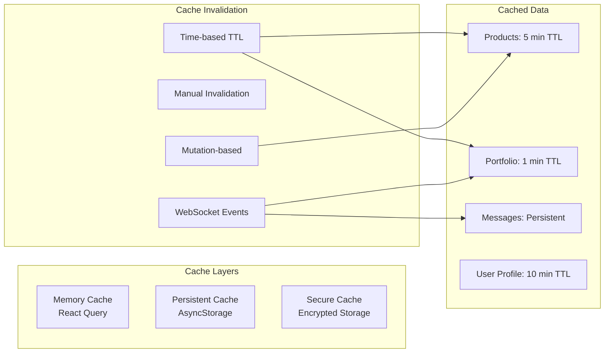
```mermaid
graph LR
    subgraph "Cache Layers"
        L1[Memory Cache<br/>React Query]
        L2[Persistent Cache<br/>AsyncStorage]
        L3[Secure Cache<br/>Encrypted Storage]
    end
    
    subgraph "Cache Invalidation"
        CI1[Time-based TTL]
        CI2[Manual Invalidation]
        CI3[Mutation-based]
        CI4[WebSocket Events]
    end
    
    subgraph "Cached Data"
        CD1[Products: 5 min TTL]
        CD2[Portfolio: 1 min TTL]
        CD3[Messages: Persistent]
        CD4[User Profile: 10 min TTL]
    end
    
    CI1 --> CD1
    CI1 --> CD2
    CI3 --> CD1
    CI4 --> CD2
    CI4 --> CD3
```

---

## 10. Testing Architecture

### 10.1 Testing Pyramid

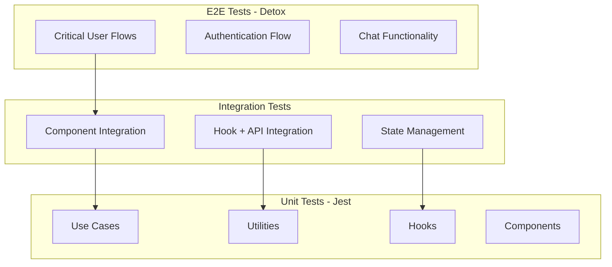
```mermaid
graph TB
    subgraph "E2E Tests - Detox"
        E2E1[Critical User Flows]
        E2E2[Authentication Flow]
        E2E3[Chat Functionality]
    end
    
    subgraph "Integration Tests"
        IT1[Component Integration]
        IT2[Hook + API Integration]
        IT3[State Management]
    end
    
    subgraph "Unit Tests - Jest"
        UT1[Use Cases]
        UT2[Utilities]
        UT3[Hooks]
        UT4[Components]
    end
    
    E2E1 --> IT1
    IT1 --> UT1
    IT2 --> UT2
    IT3 --> UT3
```

### 10.2 Test Coverage by Layer

| Layer | Test Type | Coverage Target | Focus Areas |
|-------|-----------|-----------------|-------------|
| **Presentation** | Component Tests | 80% | Rendering, user interactions |
| **Domain** | Unit Tests | 90% | Business logic, use cases |
| **Data** | Unit + Integration | 85% | Mappers, repositories |
| **Infrastructure** | Integration Tests | 70% | API clients, storage |

---

## 11. Folder Structure

```
src/
├── app/                          # App configuration
│   ├── App.tsx                   # Root component
│   ├── providers/                # Context providers
│   │   ├── QueryProvider.tsx
│   │   ├── ThemeProvider.tsx
│   │   └── AuthProvider.tsx
│   └── navigation/               # Navigation configuration
│       ├── RootNavigator.tsx
│       ├── AuthNavigator.tsx
│       ├── MainNavigator.tsx
│       └── linking.ts            # Deep linking config
│
├── entities/                     # Domain entities
│   ├── user/
│   │   ├── User.ts
│   │   └── UserTypes.ts
│   ├── product/
│   │   ├── Product.ts
│   │   └── ProductTypes.ts
│   ├── portfolio/
│   │   ├── Portfolio.ts
│   │   ├── Asset.ts
│   │   └── PortfolioTypes.ts
│   └── chat/
│       ├── Chat.ts
│       ├── Message.ts
│       └── ChatTypes.ts
│
├── features/                     # Feature modules
│   ├── auth/
│   │   ├── screens/
│   │   │   ├── LoginScreen.tsx
│   │   │   └── ForgotPasswordScreen.tsx
│   │   ├── components/
│   │   │   ├── LoginForm.tsx
│   │   │   └── BiometricButton.tsx
│   │   ├── hooks/
│   │   │   ├── useAuth.ts
│   │   │   └── useBiometric.ts
│   │   ├── api/
│   │   │   ├── authApi.ts
│   │   │   └── authKeys.ts
│   │   └── types/
│   │       └── authTypes.ts
│   │
│   ├── products/
│   │   ├── screens/
│   │   │   ├── ProductsListScreen.tsx
│   │   │   └── ProductDetailScreen.tsx
│   │   ├── components/
│   │   │   ├── ProductCard.tsx
│   │   │   ├── ProductFilter.tsx
│   │   │   └── ProductChart.tsx
│   │   ├── hooks/
│   │   │   ├── useProducts.ts
│   │   │   └── useFavorites.ts
│   │   ├── api/
│   │   │   ├── productsApi.ts
│   │   │   └── productsKeys.ts
│   │   └── store/
│   │       └── favoritesStore.ts
│   │
│   ├── portfolio/
│   │   ├── screens/
│   │   │   ├── PortfolioScreen.tsx
│   │   │   ├── AssetDetailScreen.tsx
│   │   │   └── TransactionHistoryScreen.tsx
│   │   ├── components/
│   │   │   ├── PortfolioChart.tsx
│   │   │   ├── AssetList.tsx
│   │   │   ├── AssetItem.tsx
│   │   │   └── PortfolioSummary.tsx
│   │   ├── hooks/
│   │   │   ├── usePortfolio.ts
│   │   │   ├── useAssets.ts
│   │   │   └── useTransactions.ts
│   │   ├── api/
│   │   │   ├── portfolioApi.ts
│   │   │   └── portfolioKeys.ts
│   │   └── utils/
│   │       └── portfolioCalculations.ts
│   │
│   ├── chat/
│   │   ├── screens/
│   │   │   ├── ChatListScreen.tsx
│   │   │   └── ChatDetailScreen.tsx
│   │   ├── components/
│   │   │   ├── MessageBubble.tsx
│   │   │   ├── MessageInput.tsx
│   │   │   ├── AttachmentPicker.tsx
│   │   │   └── TypingIndicator.tsx
│   │   ├── hooks/
│   │   │   ├── useChats.ts
│   │   │   ├── useMessages.ts
│   │   │   └── useSendMessage.ts
│   │   ├── api/
│   │   │   ├── chatApi.ts
│   │   │   └── chatKeys.ts
│   │   ├── websocket/
│   │   │   ├── chatSocket.ts
│   │   │   └── socketEvents.ts
│   │   └── store/
│   │       └── chatStore.ts
│   │
│   └── profile/
│       ├── screens/
│       │   ├── ProfileScreen.tsx
│       │   ├── SettingsScreen.tsx
│       │   └── DocumentsScreen.tsx
│       ├── components/
│       │   ├── ProfileHeader.tsx
│       │   └── DocumentItem.tsx
│       ├── hooks/
│       │   ├── useProfile.ts
│       │   └── useDocuments.ts
│       └── api/
│           └── profileApi.ts
│
├── shared/                       # Shared utilities
│   ├── ui/                       # Shared UI components
│   │   ├── Button/
│   │   ├── Input/
│   │   ├── Card/
│   │   ├── Modal/
│   │   ├── Avatar/
│   │   ├── Spinner/
│   │   └── Typography/
│   │
│   ├── api/                      # Shared API utilities
│   │   ├── apiClient.ts          # Axios instance
│   │   ├── apiError.ts           # Error handling
│   │   ├── interceptors.ts       # Request/response interceptors
│   │   └── types.ts              # Common API types
│   │
│   ├── hooks/                    # Shared hooks
│   │   ├── useDebounce.ts
│   │   ├── useThrottle.ts
│   │   ├── useKeyboard.ts
│   │   └── useAppState.ts
│   │
│   ├── store/                    # Global stores
│   │   ├── authStore.ts
│   │   ├── uiStore.ts
│   │   └── sessionStore.ts
│   │
│   ├── storage/                  # Storage utilities
│   │   ├── secureStorage.ts
│   │   ├── asyncStorage.ts
│   │   └── encryption.ts
│   │
│   ├── utils/                    # Utility functions
│   │   ├── formatters.ts         # Date, number formatting
│   │   ├── validators.ts         # Validation functions
│   │   ├── helpers.ts            # General helpers
│   │   └── constants.ts          # App constants
│   │
│   └── types/                    # Shared TypeScript types
│       ├── common.ts
│       ├── api.ts
│       └── navigation.ts
│
├── services/                     # External services
│   ├── pushNotifications/
│   │   ├── index.ts
│   │   └── handlers.ts
│   ├── analytics/
│   │   ├── index.ts
│   │   └── events.ts
│   ├── crashReporting/
│   │   └── sentry.ts
│   └── biometrics/
│       └── index.ts
│
├── assets/                       # Static assets
│   ├── images/
│   ├── fonts/
│   ├── icons/
│   └── animations/
│
└── config/                       # Configuration
    ├── api.config.ts
    ├── app.config.ts
    └── env.ts
```

---

## 12. Key Architectural Decisions Summary

| Decision | Choice | Rationale |
|----------|--------|-----------|
| **Architecture Pattern** | Clean Architecture | Testability, maintainability, separation of concerns |
| **State Management** | React Query + Zustand | Optimal for server vs client state |
| **Navigation** | React Navigation v6 | Industry standard, feature-rich |
| **HTTP Client** | Axios | Interceptors, request/response transformation |
| **WebSocket** | Socket.io Client | Reliable, automatic reconnection |
| **Styling** | NativeWind (Tailwind) | Rapid development, consistent design |
| **Forms** | React Hook Form | Performance, validation |
| **Storage** | SecureStore + AsyncStorage | Security for sensitive data |
| **Charts** | Victory Native | Declarative, customizable |

---

## 13. Next Steps

1. **Create ADRs** for each key architectural decision
2. **Set up project structure** with chosen folder organization
3. **Implement core infrastructure** (API client, storage, navigation)
4. **Create shared components** and design system
5. **Develop feature modules** following clean architecture principles

---

**Document Status:** Complete
**Next Phase:** Create Architecture Decision Records (ADRs)
