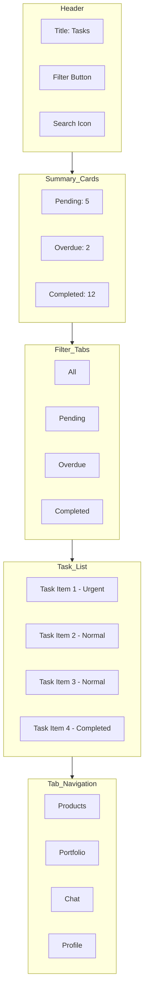
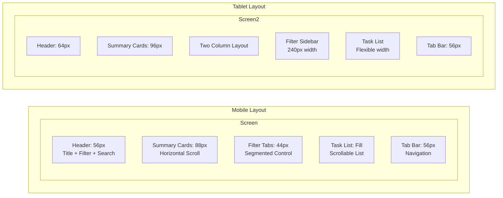
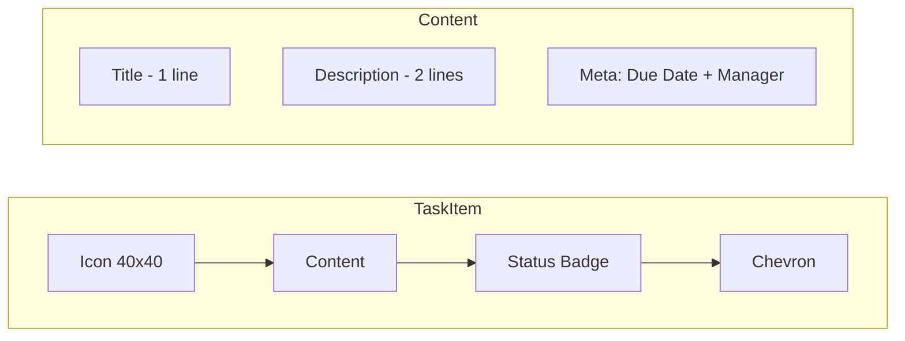
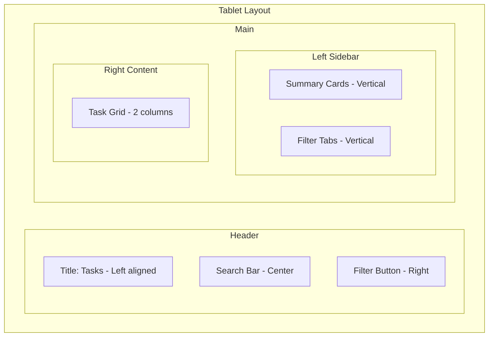

# UI Screen Specification: TaskScreen

## Document Information
- **Screen Name:** TaskScreen
- **Feature:** Task Management
- **Version:** 1.0
- **Date:** 2026-03-31
- **Author:** UI/UX Designer Agent
- **Status:** Final

---

## Table of Contents
1. [Overview](#1-overview)
2. [Layout](#2-layout)
3. [Components](#3-components)
4. [Content](#4-content)
5. [Interactions](#5-interactions)
6. [Accessibility](#6-accessibility)
7. [Responsive Behavior](#7-responsive-behavior)
8. [States](#8-states)

---

## 1. Overview

### 1.1 Screen Purpose

The TaskScreen provides users with a centralized view of all action items and tasks related to their investment portfolio. Tasks may include document submissions, signature requests, meeting scheduling, information requests from their personal manager, and investment decision confirmations.

### 1.2 User Goals

| User Story | Priority |
|------------|----------|
| View all pending and completed tasks in one place | High |
| Quickly identify urgent tasks requiring immediate attention | High |
| Complete simple tasks directly from the screen | Medium |
| View task details and instructions | High |
| Filter tasks by status, type, or date | Medium |
| Receive notifications for new and overdue tasks | High |

### 1.3 Business Goals

- Increase task completion rate
- Reduce time to complete required actions
- Improve client-manager communication efficiency
- Ensure compliance document submissions are timely
- Provide clear audit trail of client actions

### 1.4 Entry Points

| Entry Point | Context |
|-------------|---------|
| **Tab Navigation** | Tasks tab in main navigation |
| **Push Notification** | Direct link when new task assigned |
| **Chat** | Manager sends task link in chat |
| **Portfolio Alert** | Task badge on portfolio items |
| **Dashboard Widget** | Quick access to urgent tasks |

---

## 2. Layout

### 2.1 Visual Structure



### 2.2 Screen Layout Diagram



### 2.3 Component Hierarchy

```
TaskScreen
├── Header
│   ├── BackButton (if not root)
│   ├── Title ("Tasks")
│   ├── FilterButton
│   └── SearchButton
│
├── SummarySection
│   ├── PendingCard
│   ├── OverdueCard
│   └── CompletedCard
│
├── FilterTabs
│   ├── AllTab
│   ├── PendingTab
│   ├── OverdueTab
│   └── CompletedTab
│
├── TaskList (FlatList)
│   ├── SectionHeader (optional: by date/type)
│   └── TaskItem
│       ├── TaskIcon
│       ├── TaskContent
│       │   ├── TaskTitle
│       │   ├── TaskDescription
│       │   └── TaskMeta
│       ├── TaskStatus
│       └── TaskAction
│
├── EmptyState (when no tasks)
│   ├── EmptyIcon
│   ├── EmptyMessage
│   └── EmptyAction
│
└── TabBar
    ├── ProductsTab
    ├── PortfolioTab
    ├── TasksTab (active)
    ├── ChatTab
    └── ProfileTab
```

### 2.4 Grid System

#### Mobile (< 768px)
- **Container:** Full width with 16px horizontal padding
- **Columns:** 1 column for task list
- **Summary Cards:** Horizontal scroll, 110px width each
- **Gutter:** 12px between cards

#### Tablet (≥ 768px)
- **Container:** Max width 720px, centered
- **Columns:** 2 columns optional for task grid
- **Summary Cards:** Inline flex, equal width
- **Gutter:** 16px between elements

---

## 3. Components

### 3.1 Component List

| Component | Source | Priority |
|-----------|--------|----------|
| **Header** | Shared | Required |
| **SummaryCard** | Feature | Required |
| **FilterTabs** | Shared | Required |
| **TaskItem** | Feature | Required |
| **TaskIcon** | Feature | Required |
| **TaskStatusBadge** | Feature | Required |
| **EmptyState** | Shared | Required |
| **TabBar** | Shared | Required |
| **SearchBar** | Shared | Optional |
| **FilterModal** | Feature | Optional |
| **TaskDetailModal** | Feature | Optional |

### 3.2 SummaryCard Component

#### Props
```typescript
interface SummaryCardProps {
  type: 'pending' | 'overdue' | 'completed';
  count: number;
  onPress?: () => void;
  testID?: string;
}
```

#### Variants

| Type | Background | Text Color | Icon |
|------|------------|------------|------|
| **Pending** | `bg-warning-50` | `text-warning-700` | `Clock` |
| **Overdue** | `bg-error-50` | `text-error-700` | `AlertCircle` |
| **Completed** | `bg-success-50` | `text-success-700` | `CheckCircle` |

#### Styles
```typescript
const summaryCardStyles = {
  container: 'w-[110px] rounded-xl p-3 bg-surface',
  pending: 'bg-warning-50 border border-warning-200',
  overdue: 'bg-error-50 border border-error-200',
  completed: 'bg-success-50 border border-success-200',
  count: 'text-2xl font-bold font-mono',
  label: 'text-xs font-medium mt-1',
  icon: 'w-5 h-5 absolute top-2 right-2',
};
```

### 3.3 FilterTabs Component

#### Props
```typescript
interface FilterTabsProps {
  tabs: Array<{
    key: string;
    label: string;
    count?: number;
  }>;
  activeTab: string;
  onTabChange: (key: string) => void;
  testID?: string;
}
```

#### Styles
```typescript
const filterTabsStyles = {
  container: 'flex-row bg-gray-100 dark:bg-gray-800 rounded-lg p-1 mx-4',
  tab: 'flex-1 py-2 px-3 rounded-md items-center justify-center',
  activeTab: 'bg-white dark:bg-gray-700 shadow-sm',
  inactiveTab: 'bg-transparent',
  label: 'text-sm font-medium',
  activeLabel: 'text-gray-900 dark:text-gray-100',
  inactiveLabel: 'text-gray-600 dark:text-gray-400',
  badge: 'bg-gray-200 dark:bg-gray-600 rounded-full px-2 py-0.5 ml-1',
  badgeText: 'text-xs font-mono',
};
```

### 3.4 TaskItem Component

#### Props
```typescript
interface TaskItemProps {
  task: {
    id: string;
    title: string;
    description?: string;
    type: TaskType;
    status: TaskStatus;
    priority: 'urgent' | 'high' | 'normal' | 'low';
    dueDate?: Date;
    createdAt: Date;
    completedAt?: Date;
    manager?: {
      id: string;
      name: string;
      avatar?: string;
    };
    relatedProduct?: {
      id: string;
      name: string;
    };
    actionLabel?: string;
    actionType?: 'navigate' | 'modal' | 'external';
  };
  onPress: (task: Task) => void;
  onAction?: (task: Task) => void;
  testID?: string;
}

type TaskType = 
  | 'document_request'
  | 'signature_request'
  | 'meeting_request'
  | 'information_request'
  | 'investment_decision'
  | 'kyc_update'
  | 'review_request';

type TaskStatus = 'pending' | 'in_progress' | 'overdue' | 'completed';
```

#### Layout



#### Styles
```typescript
const taskItemStyles = {
  container: 'flex-row items-start bg-white dark:bg-gray-900 px-4 py-3 border-b border-gray-100 dark:border-gray-800',
  pressed: 'active:bg-gray-50 dark:active:bg-gray-800',
  iconContainer: 'w-10 h-10 rounded-xl items-center justify-center mr-3',
  content: 'flex-1',
  title: 'text-base font-medium text-gray-900 dark:text-gray-100',
  description: 'text-sm text-gray-600 dark:text-gray-400 mt-0.5',
  meta: 'flex-row items-center mt-1.5',
  dueDate: 'text-xs text-gray-500 dark:text-gray-500',
  manager: 'text-xs text-primary-600 dark:text-primary-400 ml-2',
  statusBadge: 'px-2 py-0.5 rounded-full',
  chevron: 'w-5 h-5 text-gray-400 ml-2',
  
  // Priority indicators
  urgent: 'border-l-4 border-l-error-500',
  high: 'border-l-4 border-l-warning-500',
  normal: 'border-l-4 border-l-transparent',
  low: 'border-l-4 border-l-transparent',
};
```

### 3.5 TaskIcon Component

#### Icon by Task Type

| Task Type | Icon | Color | Background |
|-----------|------|-------|------------|
| **document_request** | `FileText` | `primary-600` | `bg-primary-50` |
| **signature_request** | `PenTool` | `warning-600` | `bg-warning-50` |
| **meeting_request** | `Calendar` | `secondary-600` | `bg-secondary-50` |
| **information_request** | `MessageSquare` | `info-600` | `bg-info-50` |
| **investment_decision** | `TrendingUp` | `success-600` | `bg-success-50` |
| **kyc_update** | `UserCheck` | `primary-600` | `bg-primary-50` |
| **review_request** | `Eye` | `gray-600` | `bg-gray-100` |

### 3.6 TaskStatusBadge Component

#### Variants

| Status | Label | Background | Text Color |
|--------|-------|------------|------------|
| **pending** | "Pending" | `bg-warning-100` | `text-warning-700` |
| **in_progress** | "In Progress" | `bg-primary-100` | `text-primary-700` |
| **overdue** | "Overdue" | `bg-error-100` | `text-error-700` |
| **completed** | "Completed" | `bg-success-100` | `text-success-700` |

#### Styles
```typescript
const statusBadgeStyles = {
  base: 'px-2 py-0.5 rounded-full',
  pending: 'bg-warning-100 text-warning-700',
  in_progress: 'bg-primary-100 text-primary-700',
  overdue: 'bg-error-100 text-error-700',
  completed: 'bg-success-100 text-success-700',
  text: 'text-xs font-medium',
};
```

### 3.7 EmptyState Component

#### Props
```typescript
interface EmptyStateProps {
  type: 'no_tasks' | 'no_results' | 'error';
  searchQuery?: string;
  onRetry?: () => void;
  onReset?: () => void;
  testID?: string;
}
```

#### Styles
```typescript
const emptyStateStyles = {
  container: 'flex-1 items-center justify-center px-8 py-12',
  icon: 'w-16 h-16 text-gray-300 dark:text-gray-600 mb-4',
  title: 'text-lg font-semibold text-gray-900 dark:text-gray-100 mb-2',
  message: 'text-sm text-gray-500 dark:text-gray-400 text-center mb-6',
  button: 'px-6 py-3',
};
```

---

## 4. Content

### 4.1 Text Content

#### Header
| Element | Content |
|---------|---------|
| **Title** | "Tasks" |
| **Filter Button Aria** | "Filter tasks" |
| **Search Button Aria** | "Search tasks" |

#### Summary Cards
| Card | Label | Aria Label |
|------|-------|------------|
| **Pending** | "Pending" | "{count} pending tasks" |
| **Overdue** | "Overdue" | "{count} overdue tasks" |
| **Completed** | "Completed" | "{count} completed tasks" |

#### Filter Tabs
| Tab | Label | Aria Label |
|-----|-------|------------|
| **All** | "All" | "Show all tasks" |
| **Pending** | "Pending" | "Show pending tasks" |
| **Overdue** | "Overdue" | "Show overdue tasks" |
| **Completed** | "Completed" | "Show completed tasks" |

#### Task Item
| Element | Content | Dynamic |
|---------|---------|---------|
| **Title** | Task title from backend | Yes |
| **Description** | Task description (truncated) | Yes |
| **Due Date** | "Due {date}" or "Overdue by {days}" | Yes |
| **Manager** | "From {manager name}" | Yes |
| **Action** | Task-specific action label | Yes |

#### Due Date Formatting
```typescript
// Due date display logic
const formatDueDate = (dueDate: Date, status: TaskStatus): string => {
  const now = new Date();
  const diff = differenceInDays(dueDate, now);
  
  if (status === 'completed') {
    return `Completed ${formatRelative(completedAt, now)}`;
  }
  
  if (status === 'overdue') {
    return `Overdue by ${Math.abs(diff)} days`;
  }
  
  if (diff === 0) {
    return 'Due today';
  }
  
  if (diff === 1) {
    return 'Due tomorrow';
  }
  
  if (diff <= 7) {
    return `Due in ${diff} days`;
  }
  
  return `Due ${format(dueDate, 'MMM d')}`;
};
```

### 4.2 Icons (Lucide React Native)

| Icon | Name | Size | Usage |
|------|------|------|-------|
| Filter | `SlidersHorizontal` | 20px | Filter button |
| Search | `Search` | 20px | Search button |
| Clock | `Clock` | 20px | Pending status |
| Alert Circle | `AlertCircle` | 20px | Overdue status |
| Check Circle | `CheckCircle` | 20px | Completed status |
| Chevron Right | `ChevronRight` | 20px | Task item indicator |
| Empty State | `ClipboardList` | 64px | No tasks |
| Error State | `AlertTriangle` | 64px | Error loading |

### 4.3 Images

| Image | Source | Size | Usage |
|-------|--------|------|-------|
| **Manager Avatar** | Backend URL | 32x32px | Task from manager |
| **Product Image** | Backend URL | 40x40px | Related product (optional) |

### 4.4 Empty States

#### No Tasks (Default)
```typescript
{
  icon: 'ClipboardList',
  title: 'No tasks yet',
  message: 'Tasks from your manager will appear here. Stay tuned!',
  action: null
}
```

#### No Results (Search/Filter)
```typescript
{
  icon: 'Search',
  title: 'No tasks found',
  message: 'Try adjusting your search or filter criteria.',
  action: {
    label: 'Reset filters',
    onPress: onReset
  }
}
```

#### Error State
```typescript
{
  icon: 'AlertTriangle',
  title: 'Failed to load tasks',
  message: 'Something went wrong. Please try again.',
  action: {
    label: 'Try again',
    onPress: onRetry
  }
}
```

### 4.5 Sample Task Data

```typescript
const sampleTasks: Task[] = [
  {
    id: '1',
    title: 'Sign Investment Agreement',
    description: 'Please review and sign the updated investment agreement for your portfolio.',
    type: 'signature_request',
    status: 'pending',
    priority: 'urgent',
    dueDate: new Date('2024-01-15'),
    createdAt: new Date('2024-01-10'),
    manager: {
      id: 'm1',
      name: 'Alexander Petrov',
      avatar: 'https://example.com/avatar.jpg'
    },
    relatedProduct: {
      id: 'p1',
      name: 'Balanced Growth Strategy'
    },
    actionLabel: 'Sign Now',
    actionType: 'navigate'
  },
  {
    id: '2',
    title: 'Submit Tax Documents',
    description: 'Annual tax documentation required for compliance.',
    type: 'document_request',
    status: 'overdue',
    priority: 'high',
    dueDate: new Date('2024-01-05'),
    createdAt: new Date('2024-01-01'),
    manager: {
      id: 'm1',
      name: 'Alexander Petrov'
    },
    actionLabel: 'Upload',
    actionType: 'modal'
  },
  {
    id: '3',
    title: 'Review Portfolio Performance',
    description: 'Your Q4 portfolio report is ready for review.',
    type: 'review_request',
    status: 'completed',
    priority: 'normal',
    dueDate: new Date('2024-01-20'),
    createdAt: new Date('2024-01-15'),
    completedAt: new Date('2024-01-18'),
    manager: {
      id: 'm1',
      name: 'Alexander Petrov'
    }
  }
];
```

---

## 5. Interactions

### 5.1 User Actions

| Action | Trigger | Result |
|--------|---------|--------|
| **View Task Detail** | Tap task item | Navigate to TaskDetailScreen or open modal |
| **Quick Action** | Tap action button | Execute task-specific action (sign, upload, etc.) |
| **Filter Tasks** | Tap filter button | Open filter modal |
| **Search Tasks** | Tap search button | Expand search bar |
| **Change Tab** | Tap filter tab | Filter list by status |
| **View Summary** | Tap summary card | Scroll to filtered section |
| **Pull to Refresh** | Pull down on list | Refresh task data |
| **Load More** | Scroll to bottom | Load next page (pagination) |

### 5.2 Transitions

#### Navigation Transitions

| From | To | Animation |
|------|-----|-----------|
| TaskScreen | TaskDetailScreen | Slide from right |
| TaskScreen | FilterModal | Fade + slide up |
| TaskScreen | SearchBar | Fade in + slide down |
| TaskScreen | DocumentUpload | Slide from right |
| TaskScreen | SignatureScreen | Slide from right |

#### Screen Transition Specifications

```typescript
// React Navigation configuration
const screenOptions = {
  animation: 'slide_from_right',
  animationDuration: 300,
  gestureEnabled: true,
  gestureDirection: 'horizontal',
};

// Modal transition
const modalOptions = {
  animation: 'fade',
  animationDuration: 200,
  presentation: 'transparentModal',
};
```

### 5.3 Animations

#### List Item Animations

```typescript
// Task item entering animation (React Native Reanimated)
const taskItemEntering = () => {
  'worklet';
  const animations = {
    opacity: withTiming(1, { duration: 300 }),
    transform: [
      { translateX: withTiming(0, { duration: 300 }) }
    ]
  };
  const initialValues = {
    opacity: 0,
    transform: [{ translateX: -20 }]
  };
  return { animations, initialValues };
};

// Task item layout animation
const taskItemLayout = () => {
  'worklet';
  return {
    animations: {
      height: withTiming(0, { duration: 200 }),
      opacity: withTiming(0, { duration: 200 })
    },
  };
};
```

#### Summary Card Animation

```typescript
// Summary card scale on press
const summaryCardAnimation = {
  scaleOnPress: {
    from: { scale: 1 },
    to: { scale: 0.95 },
    config: { duration: 100 }
  }
};
```

#### Pull to Refresh Animation

```typescript
// Custom refresh indicator
const RefreshControl = () => {
  const [refreshing, setRefreshing] = useState(false);
  
  return (
    <RefreshControl
      refreshing={refreshing}
      onRefresh={onRefresh}
      tintColor="#3B82F6" // primary-500
      title="Pull to refresh"
      titleColor="#6B7280" // gray-500
    />
  );
};
```

#### Skeleton Loading Animation

```typescript
// Skeleton pulse animation
const skeletonStyles = {
  base: 'bg-gray-200 dark:bg-gray-700 rounded-md',
  animation: 'animate-pulse',
  text: 'h-4 w-3/4',
  title: 'h-5 w-1/2',
  avatar: 'h-10 w-10 rounded-full',
};
```

### 5.4 Gesture Interactions

| Gesture | Element | Action |
|---------|---------|--------|
| **Tap** | Task item | Navigate to detail |
| **Tap** | Summary card | Filter by status |
| **Tap** | Tab | Switch filter |
| **Long Press** | Task item | Show quick actions menu |
| **Swipe Left** | Task item | Quick complete (if applicable) |
| **Pull Down** | Task list | Refresh |
| **Tap (Background)** | Modal | Close modal |

### 5.5 Haptic Feedback

| Action | Haptic Type | Platform |
|--------|-------------|----------|
| **Task Complete** | `success` | iOS/Android |
| **Filter Change** | `light` | iOS/Android |
| **Error** | `error` | iOS/Android |
| **Pull to Refresh** | `medium` | iOS/Android |

```typescript
// Haptic feedback implementation
import * as Haptics from 'expo-haptics';

const onTaskComplete = async () => {
  Haptics.notificationAsync(Haptics.NotificationFeedbackType.Success);
  // ... complete task logic
};

const onTabChange = () => {
  Haptics.impactAsync(Haptics.ImpactFeedbackStyle.Light);
};
```

---

## 6. Accessibility

### 6.1 ARIA Labels

#### Header Elements
```typescript
// Header accessibility
<View 
  accessible={false}
>
  <Text 
    accessibilityRole="header"
    accessibilityLevel={1}
  >
    Tasks
  </Text>
  
  <TouchableOpacity
    accessible={true}
    accessibilityLabel="Filter tasks"
    accessibilityHint="Opens filter options to narrow down tasks"
    accessibilityRole="button"
  >
    <FilterIcon />
  </TouchableOpacity>
  
  <TouchableOpacity
    accessible={true}
    accessibilityLabel="Search tasks"
    accessibilityHint="Opens search to find specific tasks"
    accessibilityRole="button"
  >
    <SearchIcon />
  </TouchableOpacity>
</View>
```

#### Summary Cards
```typescript
// Summary card accessibility
<TouchableOpacity
  accessible={true}
  accessibilityLabel={`${count} ${status} tasks`}
  accessibilityHint={`Tap to view all ${status} tasks`}
  accessibilityRole="button"
  onPress={() => filterByStatus(status)}
>
  <View>
    <Text accessibilityRole="text">{count}</Text>
    <Text accessibilityRole="text">{label}</Text>
  </View>
</TouchableOpacity>
```

#### Filter Tabs
```typescript
// Filter tabs accessibility
<View 
  accessible={true}
  accessibilityRole="tablist"
  accessibilityLabel="Task filter tabs"
>
  {tabs.map(tab => (
    <TouchableOpacity
      key={tab.key}
      accessible={true}
      accessibilityRole="tab"
      accessibilityLabel={`${tab.label}${tab.count ? `, ${tab.count} tasks` : ''}`}
      accessibilityState={{ selected: activeTab === tab.key }}
      onPress={() => onTabChange(tab.key)}
    >
      <Text>{tab.label}</Text>
      {tab.count && (
        <Text accessibilityLabel={`${tab.count} tasks`}>
          {tab.count}
        </Text>
      )}
    </TouchableOpacity>
  ))}
</View>
```

### 6.2 Task Item Accessibility

```typescript
// Task item accessibility
<TouchableOpacity
  accessible={true}
  accessibilityLabel={getTaskAccessibilityLabel(task)}
  accessibilityHint={getTaskAccessibilityHint(task)}
  accessibilityRole="button"
  onPress={() => onPress(task)}
>
  {/* Task content */}
</TouchableOpacity>

// Accessibility label generator
const getTaskAccessibilityLabel = (task: Task): string => {
  const parts = [
    task.title,
    task.description,
    getPriorityText(task.priority),
    getStatusText(task.status),
    task.dueDate && `Due ${formatDueDate(task.dueDate)}`,
    task.manager && `From ${task.manager.name}`
  ].filter(Boolean);
  
  return parts.join('. ');
};

const getTaskAccessibilityHint = (task: Task): string => {
  if (task.status === 'completed') {
    return 'Completed. Tap to view details.';
  }
  
  if (task.actionLabel) {
    return `Tap to ${task.actionLabel.toLowerCase()}`;
  }
  
  return 'Tap to view task details';
};

// Priority text
const getPriorityText = (priority: string): string => {
  const priorityMap = {
    urgent: 'Urgent priority',
    high: 'High priority',
    normal: 'Normal priority',
    low: 'Low priority'
  };
  return priorityMap[priority] || '';
};

// Status text
const getStatusText = (status: string): string => {
  const statusMap = {
    pending: 'Pending',
    in_progress: 'In progress',
    overdue: 'Overdue',
    completed: 'Completed'
  };
  return statusMap[status] || '';
};
```

### 6.3 Screen Reader Announcements

```typescript
// Screen reader announcements
import { announceForAccessibility } from 'react-native';

// On task completion
const onTaskComplete = (task: Task) => {
  announceForAccessibility(`Task "${task.title}" marked as completed`);
};

// On filter change
const onFilterChange = (filter: string) => {
  announceForAccessibility(`Showing ${filter} tasks`);
};

// On data load
const onDataLoad = (count: number) => {
  announceForAccessibility(`Loaded ${count} tasks`);
};

// On error
const onError = (error: Error) => {
  announceForAccessibility(`Error loading tasks: ${error.message}`);
};
```

### 6.4 Keyboard Navigation

#### Focus Order
```
1. Header → Title (static)
2. Filter Button
3. Search Button
4. Summary Cards (Pending → Overdue → Completed)
5. Filter Tabs (All → Pending → Overdue → Completed)
6. Task List Items (top to bottom)
7. Tab Bar (Products → Portfolio → Tasks → Chat → Profile)
```

#### Keyboard Shortcuts

| Shortcut | Action |
|----------|--------|
| **Tab** | Move to next focusable element |
| **Shift + Tab** | Move to previous focusable element |
| **Enter / Space** | Activate focused element |
| **Escape** | Close modal / Cancel action |
| **Arrow Keys** | Navigate within tab list |
| **f** | Open filter modal (when not in input) |
| **s** | Focus search (when not in input) |
| **r** | Refresh tasks |

### 6.5 Focus Management

```typescript
// Focus management for modals
const FilterModal: React.FC = ({ isOpen, onClose }) => {
  const firstFocusableRef = useRef(null);
  const lastFocusedElement = useRef(null);
  
  useEffect(() => {
    if (isOpen) {
      // Store last focused element
      lastFocusedElement.current = document.activeElement;
      
      // Focus first element in modal
      firstFocusableRef.current?.focus();
    } else {
      // Restore focus when modal closes
      lastFocusedElement.current?.focus();
    }
  }, [isOpen]);
  
  return (
    <Modal visible={isOpen}>
      <TouchableOpacity
        ref={firstFocusableRef}
        accessibilityRole="button"
      >
        {/* First focusable element */}
      </TouchableOpacity>
    </Modal>
  );
};
```

### 6.6 Color Contrast Validation

| Element | Foreground | Background | Ratio | Status |
|---------|------------|------------|-------|--------|
| Task title | `gray-900` | `white` | 18.1:1 | ✅ AAA |
| Task description | `gray-600` | `white` | 7.1:1 | ✅ AAA |
| Pending badge | `warning-700` | `warning-100` | 4.5:1 | ✅ AA |
| Overdue badge | `error-700` | `error-100` | 5.5:1 | ✅ AA |
| Completed badge | `success-700` | `success-100` | 5.1:1 | ✅ AA |
| Filter tab (active) | `gray-900` | `white` | 18.1:1 | ✅ AAA |

### 6.7 Reduced Motion

```typescript
// Respect user's motion preferences
import { useReducedMotion } from 'react-native-reanimated';

const TaskItem: React.FC<TaskItemProps> = ({ task }) => {
  const reducedMotion = useReducedMotion();
  
  const entering = reducedMotion
    ? FadeIn.duration(0)
    : FadeInRight.duration(300);
  
  return (
    <Animated.View entering={entering}>
      {/* Task content */}
    </Animated.View>
  );
};
```

---

## 7. Responsive Behavior

### 7.1 Breakpoint Behavior

| Breakpoint | Layout | Summary Cards | Filter | Task List |
|------------|--------|---------------|--------|-----------|
| **xs** (< 375px) | Single column | Horizontal scroll | Full width tabs | Single column |
| **sm** (375-639px) | Single column | Horizontal scroll | Full width tabs | Single column |
| **md** (640-767px) | Single column | Inline grid | Full width tabs | Single column |
| **lg** (768-1023px) | Centered max 720px | Inline grid | Segmented control | Single column |
| **xl** (1024px+) | Centered max 900px | Inline grid | Segmented control | 2 columns optional |

### 7.2 Responsive Styles

```typescript
// Responsive container
const containerStyles = {
  base: 'flex-1 bg-background',
  padding: 'px-4 md:px-6 lg:px-8',
  maxWidth: 'max-w-3xl lg:max-w-4xl',
  center: 'mx-auto',
};

// Summary cards responsive
const summaryCardsStyles = {
  container: 'flex-row',
  mobile: 'overflow-x-auto pb-2 -mx-4 px-4',
  tablet: 'flex-wrap justify-start gap-3',
  card: 'w-[110px] md:w-auto md:flex-1 md:max-w-[160px]',
};

// Task list responsive
const taskListStyles = {
  container: 'flex-1',
  grid: 'lg:grid-cols-2 lg:gap-4',
  item: 'mb-2 lg:mb-4',
};
```

### 7.3 Tablet Enhancements

#### iPad / Tablet Layout



#### Tablet Features
- **Two-column task grid** for better space utilization
- **Filter sidebar** on larger screens (≥ 1024px)
- **Inline search bar** instead of modal
- **Larger touch targets** (48x48px minimum)
- **Keyboard shortcuts** visible in tooltips

### 7.4 Orientation Support

#### Portrait
- Default layout as specified
- Single column task list
- Horizontal summary scroll

#### Landscape (Phone)
- Summary cards inline
- Condensed task items
- Quick actions visible

#### Landscape (Tablet)
- Two-column layout preferred
- Sidebar visible
- Full filter panel

---

## 8. States

### 8.1 Loading States

#### Initial Load
```typescript
const LoadingState = () => (
  <View className="flex-1 px-4 py-4">
    {/* Summary cards skeleton */}
    <View className="flex-row gap-3 mb-6">
      {[1, 2, 3].map(i => (
        <View 
          key={i}
          className="w-[110px] h-[88px] bg-gray-200 dark:bg-gray-700 rounded-xl animate-pulse"
        />
      ))}
    </View>
    
    {/* Filter tabs skeleton */}
    <View className="h-10 bg-gray-200 dark:bg-gray-700 rounded-lg mb-4 animate-pulse" />
    
    {/* Task items skeleton */}
    {[1, 2, 3, 4, 5].map(i => (
      <View key={i} className="flex-row items-start mb-4 animate-pulse">
        <View className="w-10 h-10 bg-gray-200 dark:bg-gray-700 rounded-xl mr-3" />
        <View className="flex-1">
          <View className="h-5 bg-gray-200 dark:bg-gray-700 rounded mb-2 w-3/4" />
          <View className="h-4 bg-gray-200 dark:bg-gray-700 rounded mb-1 w-1/2" />
          <View className="h-3 bg-gray-200 dark:bg-gray-700 rounded w-1/3" />
        </View>
      </View>
    ))}
  </View>
);
```

#### Pull to Refresh
- Keep current content visible
- Show refresh indicator at top
- Update content smoothly when complete

### 8.2 Error States

#### Network Error
```typescript
const NetworkErrorState = () => (
  <EmptyState
    type="error"
    icon="Wifi"
    title="No internet connection"
    message="Please check your connection and try again."
    action={{
      label: 'Try again',
      onPress: onRetry
    }}
  />
);
```

#### Server Error
```typescript
const ServerErrorState = () => (
  <EmptyState
    type="error"
    icon="AlertTriangle"
    title="Failed to load tasks"
    message="We're having trouble loading your tasks. Our team has been notified."
    action={{
      label: 'Try again',
      onPress: onRetry
    }}
  />
);
```

### 8.3 Empty States

#### No Tasks (First Time)
```typescript
<EmptyState
  icon="ClipboardList"
  title="No tasks yet"
  message="Tasks from your manager will appear here. You'll be notified when there's something to do."
  action={null}
/>
```

#### No Tasks (Filtered)
```typescript
<EmptyState
  icon="Filter"
  title="No matching tasks"
  message={`No ${activeFilter} tasks found. Try a different filter.`}
  action={{
    label: 'Show all tasks',
    onPress: resetFilter
  }}
/>
```

#### No Search Results
```typescript
<EmptyState
  icon="Search"
  title="No results found"
  message={`No tasks match "${searchQuery}". Try different keywords.`}
  action={{
    label: 'Clear search',
    onPress: clearSearch
  }}
/>
```

### 8.4 Success States

#### Task Completed
```typescript
// Toast notification on task completion
Toast.show({
  type: 'success',
  text1: 'Task completed',
  text2: `"${task.title}" has been marked as complete.`,
  position: 'bottom',
  visibilityTime: 3000,
  autoHide: true,
});
```

#### All Tasks Completed
```typescript
<EmptyState
  icon="CheckCircle"
  title="All caught up!"
  message="You've completed all your tasks. Great job!"
  action={null}
/>
```

### 8.5 Offline State

```typescript
// Offline banner at top of screen
const OfflineBanner = () => (
  <View className="bg-warning-50 border-b border-warning-200 px-4 py-2">
    <View className="flex-row items-center">
      <WifiOff className="w-4 h-4 text-warning-600 mr-2" />
      <Text className="text-sm text-warning-700">
        You're offline. Some features may be unavailable.
      </Text>
    </View>
  </View>
);

// Show cached tasks with indicator
<View className="flex-row items-center px-4 py-2 bg-gray-50">
  <Text className="text-xs text-gray-500">
    Last updated: 5 minutes ago
  </Text>
  <TouchableOpacity onPress={onRefresh} className="ml-2">
    <RefreshCw className="w-3 h-3 text-primary-600" />
  </TouchableOpacity>
</View>
```

---

## 9. Implementation Notes

### 9.1 Performance Considerations

- Use `FlatList` with `getItemLayout` for predictable scrolling
- Implement `keyExtractor` with stable task IDs
- Use `React.memo` for TaskItem components
- Implement virtualized list for large task counts
- Cache task data locally for offline support
- Use pagination (20 items per page)
- Debounce search input (300ms)

### 9.2 Data Requirements

```typescript
// Task API response
interface TasksResponse {
  tasks: Task[];
  pagination: {
    page: number;
    pageSize: number;
    total: number;
    hasMore: boolean;
  };
  summary: {
    pending: number;
    overdue: number;
    completed: number;
  };
}

// Task query parameters
interface TasksQuery {
  status?: 'pending' | 'overdue' | 'completed' | 'all';
  type?: TaskType;
  priority?: 'urgent' | 'high' | 'normal' | 'low';
  search?: string;
  managerId?: string;
  page?: number;
  pageSize?: number;
}
```

### 9.3 Analytics Events

| Event | Properties | Trigger |
|-------|------------|---------|
| `tasks_screen_viewed` | `tasks_count`, `filter` | Screen mount |
| `task_tapped` | `task_id`, `task_type`, `status` | Task item tap |
| `task_completed` | `task_id`, `task_type`, `time_to_complete` | Task marked complete |
| `task_filter_changed` | `filter_type`, `previous_filter` | Filter change |
| `task_search_performed` | `query_length`, `results_count` | Search submit |
| `tasks_refreshed` | `tasks_count` | Pull to refresh |

---

## 10. Test Cases

### 10.1 Visual Tests

| Test | Expected Result |
|------|-----------------|
| Render with tasks | Task list displays correctly |
| Render empty state | Empty state with proper message |
| Render loading state | Skeleton screens display |
| Dark mode | All elements properly styled |
| Long text truncation | Title/description truncate properly |

### 10.2 Interaction Tests

| Test | Expected Result |
|------|-----------------|
| Tap task item | Navigates to detail screen |
| Tap summary card | Filters by status |
| Tap filter tab | Updates filter and list |
| Pull to refresh | Refreshes task data |
| Search tasks | Filters list by query |
| Long press task | Shows quick actions |

### 10.3 Accessibility Tests

| Test | Expected Result |
|------|-----------------|
| Screen reader navigation | Logical focus order |
| Screen reader labels | All elements have proper labels |
| Keyboard navigation | All actions keyboard accessible |
| Color contrast | All text meets WCAG AA |
| Touch targets | All targets ≥ 44x44px |

---

**Document Status:** Final  
**Last Updated:** 2026-03-31  
**Next Review:** 2026-04-30